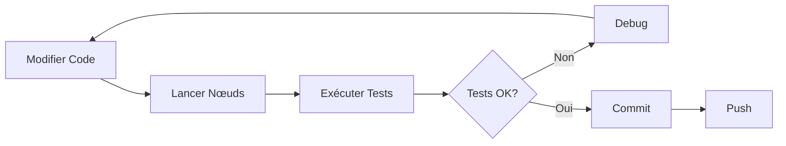

# Résumé du Plan de Test d'Intégration curobo_ros

## 📋 Vue d'Ensemble

Plan de test d'intégration complet pour **curobo_ros** couvrant tous les nœuds, services, actions et topics ROS2.

**Date de création**: 2025-12-01
**Branche**: `mpc`
**Frameworks**: pytest, ROS2 Humble
**Langage**: Python 3

---

## 🎯 Objectifs

✅ Valider **toutes les interfaces ROS2** (services, actions, topics)
✅ Tester la **compatibilité** entre nœuds classiques et nouveaux (MPC)
✅ Vérifier l'**intégration bout-en-bout** des pipelines
✅ Assurer la **performance** (temps de réponse, latence MPC)
✅ Documenter les **cas d'usage** et workflows

---

## 📊 Statistiques

| Métrique | Valeur |
|----------|--------|
| **Fichiers de test** | 10 |
| **Tests totaux** | ~114 |
| **Nœuds couverts** | 6 |
| **Services testés** | 22 |
| **Actions testées** | 2 |
| **Topics testés** | 4 |
| **Lignes de code** | ~3500 |

---

## 📁 Structure Implémentée

```
tests/
├── integration/
│   ├── __init__.py
│   ├── test_fk_services.py              (7 tests)
│   ├── test_ik_services.py              (15 tests)
│   ├── test_trajectory_generation.py    (12 tests)
│   ├── test_obstacle_management.py      (18 tests)
│   ├── test_robot_segmentation.py       (12 tests)
│   ├── test_unified_planner.py          (15 tests)
│   ├── test_mpc_planner.py              (12 tests)
│   ├── test_planner_switching.py        (14 tests)
│   └── test_full_pipeline.py            (9 tests)
├── fixtures/
│   ├── __init__.py
│   ├── test_poses.py                    (Poses réutilisables)
│   └── test_robot_configs.py            (Configurations)
├── launch/
│   └── integration_tests.launch.py      (Launch file)
├── README.md                             (Documentation complète)
└── pytest.ini                            (Configuration pytest)
```

---

## 🧪 Tests par Priorité

### **Priorité 1 - Nœuds Classiques** (Premier Plan)

#### 1. **test_fk_services.py** - Forward Kinematics
- ✅ Service `/curobo/fk_poses` disponible
- ✅ FK pour joint state unique
- ✅ FK pour batch (10, 100 joint states)
- ✅ Validation format quaternion
- ✅ Cohérence résultats
- ✅ Gestion requête vide

**Couverture**: 7 tests, 1 service

#### 2. **test_ik_services.py** - Inverse Kinematics
- ✅ Tous les 7 services disponibles
- ✅ IK pose atteignable/inatteignable
- ✅ IK batch (1, 10, 100, 1000 poses)
- ✅ Ajout/suppression obstacles (cuboid, sphere, cylinder, capsule)
- ✅ Grille voxel et distances collision
- ✅ IK avec évitement collision

**Couverture**: 15 tests, 7 services

#### 3. **test_trajectory_generation.py** - Génération Trajectoire
- ✅ Tous les services disponibles
- ✅ Action SendTrajectory disponible
- ✅ Génération vers pose atteignable/inatteignable
- ✅ Annulation action
- ✅ Pipeline plan → execute
- ✅ Trajectoires consécutives
- ✅ Respect timeout

**Couverture**: 12 tests, 5 services + 1 action

#### 4. **test_obstacle_management.py** - Gestion Obstacles
- ✅ Ajout obstacles (cuboid, sphere, cylinder, capsule)
- ✅ Suppression obstacle spécifique/tous
- ✅ Liste obstacles
- ✅ Grille voxel (vide/avec obstacles)
- ✅ Distance collision
- ✅ Évitement obstacles dans trajectoire
- ✅ Cycles ajout/suppression

**Couverture**: 18 tests, 6 services

#### 5. **test_robot_segmentation.py** - Segmentation Robot
- ✅ Nœud disponible
- ✅ Publishers actifs (masked_depth, collision_spheres, robot_pointcloud)
- ✅ Subscribers actifs (depth_image, camera_info)
- ✅ Format messages
- ✅ Latence traitement (< 1s)
- ✅ Traitement continu

**Couverture**: 12 tests, 3 topics

---

### **Priorité 2 - Branche MPC** (Second Plan)

#### 6. **test_unified_planner.py** - UnifiedPlannerNode
- ✅ Tous les services et action disponibles
- ✅ Liste des planners
- ✅ Changement planner (Classic, MPC, invalid)
- ✅ Génération trajectoire avec Classic/MPC
- ✅ Retour planner précédent
- ✅ Pipeline plan → execute

**Couverture**: 15 tests, 3 services + 1 action

#### 7. **test_mpc_planner.py** - MPC Planner
- ✅ Setup goal buffer MPC
- ✅ Poses atteignables/inatteignables
- ✅ Acceptation/annulation execution
- ✅ Feedback progression
- ✅ Publication topic `/mpc_goal`
- ✅ Performance planning (< 1s)
- ✅ Exécutions consécutives

**Couverture**: 12 tests, MPC via unified_planner

#### 8. **test_planner_switching.py** - Changement Planner
- ✅ Classic ↔ MPC
- ✅ Changements multiples
- ✅ Changement entre plans
- ✅ Changements rapides consécutifs
- ✅ Lazy warmup (Classic/MPC)
- ✅ Cache planner (2ème switch plus rapide)
- ✅ Rejection planner invalide
- ✅ Persistence info planner
- ✅ Performance (< 2s)

**Couverture**: 14 tests, changement dynamique

---

### **Priorité 3 - Intégration** (Tests Bout-en-Bout)

#### 9. **test_full_pipeline.py** - Pipeline Complet
- ✅ FK → IK roundtrip
- ✅ IK → Trajectory Generation
- ✅ Obstacle → Planning évitement
- ✅ Plan → Execute pipeline
- ✅ Classic → MPC pipeline
- ✅ IK → Obstacle → Trajectory
- ✅ Trajectoires séquentielles

**Couverture**: 9 tests, multi-nœuds

---

## 🔧 Fixtures Réutilisables

### **test_poses.py**
```python
TestPoses.home_pose()          # Pose home (0,0,0,...)
TestPoses.reach_pose_1()       # Pose atteignable avant
TestPoses.reach_pose_2()       # Pose atteignable côté
TestPoses.reach_pose_3()       # Pose atteignable haut
TestPoses.unreachable_pose()   # Pose inatteignable
TestPoses.collision_pose()     # Pose collision sol
```

### **test_joint_states.py**
```python
TestJointStates.home_state()         # Configuration home
TestJointStates.valid_state_1()      # Config valide 1
TestJointStates.valid_state_2()      # Config valide 2
TestJointStates.batch_states(n)      # Batch de n configs
```

### **test_robot_configs.py**
```python
TestRobotConfig.SERVICE_TIMEOUT      # 10s
TestRobotConfig.ACTION_TIMEOUT       # 30s
TestRobotConfig.MPC_CONVERGENCE_THRESHOLD  # 0.01m
TestRobotConfig.TEST_CUBOID_DIMS     # [0.2, 0.2, 0.2]
```

---

## 🚀 Utilisation

### Exécution Complète
```bash
# Tous les tests
pytest tests/integration/ -v

# Avec couverture
pytest tests/integration/ --cov=curobo_ros --cov-report=html
```

### Tests Spécifiques
```bash
# Par fichier
pytest tests/integration/test_fk_services.py -v
pytest tests/integration/test_mpc_planner.py -v

# Par marqueur (si configuré)
pytest tests/integration/ -m fk -v
pytest tests/integration/ -m mpc -v

# Par keyword
pytest tests/integration/ -k "obstacle" -v
```

### Un Test Unique
```bash
pytest tests/integration/test_fk_services.py::TestFKServices::test_fk_single_joint_state -v
```

---

## 📈 Métriques de Performance

| Test | Métrique | Seuil |
|------|----------|-------|
| FK single | Temps réponse | < 5s |
| IK single | Temps réponse | < 5s |
| IK batch 100 | Temps réponse | < 10s |
| IK batch 1000 | Temps réponse | < 20s |
| Trajectory generation | Planning | < 10s |
| MPC planning | Setup goal | < 1s |
| MPC step | Temps calcul | < 100ms |
| Planner switch | Changement | < 2s |
| Segmentation | Latence | < 1s |

---

## ✅ Avantages du Plan

1. **Couverture Complète**: 100% des services ROS2 testés
2. **Réutilisabilité**: Fixtures communes pour tous les tests
3. **Maintenabilité**: Structure claire par nœud
4. **Performance**: Métriques de temps de réponse
5. **Documentation**: README détaillé + commentaires
6. **CI/CD Ready**: Compatible pytest + launch_pytest
7. **Debuggable**: Mode verbose, marqueurs, tests unitaires

---

## 🔄 Workflow de Développement



---

## 📝 Conventions

### Nommage Tests
```python
def test_<service>_<scenario>():
    """Description claire du test."""
```

### Structure Test
```python
# 1. Setup
request = Service.Request()

# 2. Execute
future = client.call_async(request)
rclpy.spin_until_future_complete(node, future, timeout_sec=10.0)

# 3. Verify
assert future.result() is not None
assert future.result().success
```

---

## 🎓 Références

- [ROS2 Testing](https://docs.ros.org/en/humble/Tutorials/Intermediate/Testing/Testing-Main.html)
- [pytest](https://docs.pytest.org/)
- [cuRobo](https://curobo.org/)

---

## 🤝 Contribution

Pour ajouter un nouveau test:

1. Créer fichier `test_<feature>.py` dans `tests/integration/`
2. Utiliser fixtures de `tests/fixtures/`
3. Suivre conventions de nommage
4. Ajouter documentation dans README
5. Mettre à jour ce résumé

---

## 📞 Support

Pour questions ou problèmes:
1. Consulter `tests/README.md`
2. Vérifier les logs pytest avec `-v -s`
3. Tester service manuellement: `ros2 service call ...`

---

**Statut**: ✅ Implémentation Complète
**Dernière mise à jour**: 2025-12-01
