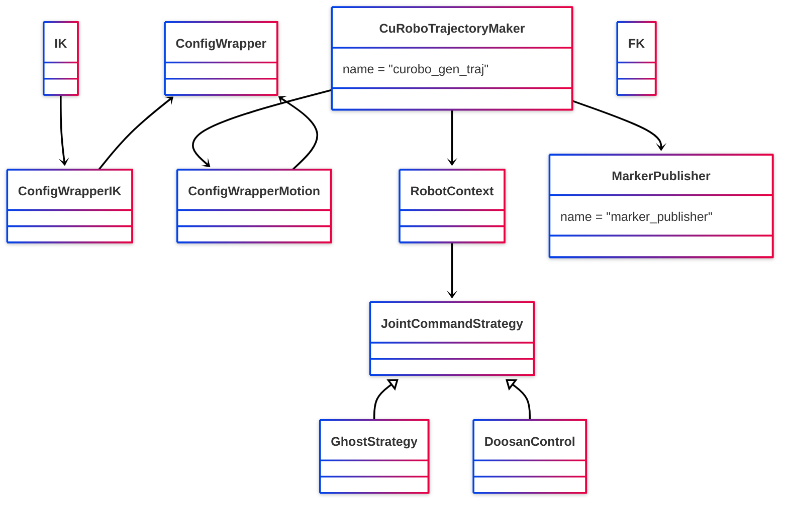

# Package architecture

## class diagramm

## Ros node interface diageramm
Example of the node interface with a doosan m1013 robot. The ExecutorTrajectory node is from the git [leeloo](https://github.com/Lab-CORO/leeloo) 

```mermaid
flowchart LR

/curobo_gen_traj[ /curobo_gen_traj ]:::main
/ExecuteTrajectory[ /ExecuteTrajectory ]:::main
/marker_publisher[ /marker_publisher ]:::main
/dsr01/joint_state_broadcaster[ /dsr01/joint_state_broadcaster ]:::node
/ExecuteTrajectory[ /ExecuteTrajectory ]:::node
/rviz2[ /rviz2 ]:::node
/dsr01/dsr_controller2[ /dsr01/dsr_controller2 ]:::node
/rviz_updata_parameters_node[ /rviz_updata_parameters_node ]:::node
/camera/camera/depth/camera_info([ /camera/camera/depth/camera_info<br>sensor_msgs/msg/CameraInfo ]):::bugged
/camera/camera/depth/image_rect_raw([ /camera/camera/depth/image_rect_raw<br>sensor_msgs/msg/Image ]):::bugged
/dsr01/joint_states([ /dsr01/joint_states<br>sensor_msgs/msg/JointState ]):::topic
/leeloo/trajectory_state([ /leeloo/trajectory_state<br>std_msgs/msg/Float32 ]):::topic
/curobo_gen_traj/collision_spheres([ /curobo_gen_traj/collision_spheres<br>visualization_msgs/msg/MarkerArray ]):::topic
/dsr01/speedj_rt_stream([ /dsr01/speedj_rt_stream<br>dsr_msgs2/msg/SpeedjRtStream ]):::topic
/leeloo/execute_trajectory([ /leeloo/execute_trajectory<br>trajectory_msgs/msg/JointTrajectory ]):::topic
/trajectory([ /trajectory<br>trajectory_msgs/msg/JointTrajectory ]):::topic
/visualization_marker_array([ /visualization_marker_array<br>visualization_msgs/msg/MarkerArray ]):::topic
/visualization_marker_voxel([ /visualization_marker_voxel<br>visualization_msgs/msg/MarkerArray ]):::topic
/curobo_gen_traj/add_object[/ /curobo_gen_traj/add_object<br>curobo_msgs/srv/AddObject \]:::bugged
/curobo_gen_traj/generate_trajectory[/ /curobo_gen_traj/generate_trajectory<br>curobo_msgs/srv/TrajectoryGeneration \]:::service
/curobo_gen_traj/get_collision_distance[/ /curobo_gen_traj/get_collision_distance<br>curobo_msgs/srv/GetCollisionDistance \]:::bugged
/curobo_gen_traj/get_obstacles[/ /curobo_gen_traj/get_obstacles<br>std_srvs/srv/Trigger \]:::bugged
/curobo_gen_traj/get_voxel_grid[/ /curobo_gen_traj/get_voxel_grid<br>curobo_msgs/srv/GetVoxelGrid \]:::bugged
/curobo_gen_traj/is_available[/ /curobo_gen_traj/is_available<br>std_srvs/srv/Trigger \]:::bugged
/curobo_gen_traj/remove_all_objects[/ /curobo_gen_traj/remove_all_objects<br>std_srvs/srv/Trigger \]:::bugged
/curobo_gen_traj/remove_object[/ /curobo_gen_traj/remove_object<br>curobo_msgs/srv/RemoveObject \]:::bugged
/curobo_gen_traj/update_motion_gen_config[/ /curobo_gen_traj/update_motion_gen_config<br>std_srvs/srv/Trigger \]:::service
/send_trajectrory{{ /send_trajectrory<br>curobo_msgs/action/SendTrajectory }}:::bugged
/camera/camera/depth/camera_info --> /curobo_gen_traj
/camera/camera/depth/image_rect_raw --> /curobo_gen_traj
/dsr01/joint_states --> /curobo_gen_traj
/leeloo/trajectory_state --> /curobo_gen_traj
/leeloo/execute_trajectory --> /ExecuteTrajectory
/leeloo/execute_trajectory --> /ExecuteTrajectory
/curobo_gen_traj/collision_spheres --> /rviz2
/trajectory --> /rviz2
/visualization_marker_array --> /rviz2
/visualization_marker_voxel --> /rviz2
/dsr01/speedj_rt_stream --> /dsr01/dsr_controller2
/curobo_gen_traj --> /curobo_gen_traj/collision_spheres
/curobo_gen_traj --> /dsr01/speedj_rt_stream
/curobo_gen_traj --> /leeloo/execute_trajectory
/curobo_gen_traj --> /trajectory
/ExecuteTrajectory --> /dsr01/speedj_rt_stream
/ExecuteTrajectory --> /leeloo/trajectory_state
/marker_publisher --> /visualization_marker_array
/marker_publisher --> /visualization_marker_voxel
/dsr01/joint_state_broadcaster --> /dsr01/joint_states
/ExecuteTrajectory --> /leeloo/trajectory_state
/curobo_gen_traj/add_object o-.-o /curobo_gen_traj
/curobo_gen_traj/generate_trajectory o-.-o /curobo_gen_traj
/curobo_gen_traj/get_collision_distance o-.-o /curobo_gen_traj
/curobo_gen_traj/get_obstacles o-.-o /curobo_gen_traj
/curobo_gen_traj/get_voxel_grid o-.-o /curobo_gen_traj
/curobo_gen_traj/is_available o-.-o /curobo_gen_traj
/curobo_gen_traj/remove_all_objects o-.-o /curobo_gen_traj
/curobo_gen_traj/remove_object o-.-o /curobo_gen_traj
/curobo_gen_traj/update_motion_gen_config o-.-o /curobo_gen_traj
/rviz_updata_parameters_node <-.-> /curobo_gen_traj/generate_trajectory
/rviz_updata_parameters_node <-.-> /curobo_gen_traj/update_motion_gen_config
/send_trajectrory o==o /curobo_gen_traj

subgraph keys[<b>Keys<b/>]
subgraph nodes[<b><b/>]
topicb((No connected)):::bugged
main_node[main]:::main
end
subgraph connection[<b><b/>]
node1[node1]:::node
node2[node2]:::node
node1 o-.-o|to server| service[/Service<br>service/Type\]:::service
service <-.->|to client| node2
node1 -->|publish| topic([Topic<br>topic/Type]):::topic
topic -->|subscribe| node2
node1 o==o|to server| action{{/Action<br>action/Type/}}:::action
action <==>|to client| node2
end
end
classDef node opacity:0.9,fill:#2A0,stroke:#391,stroke-width:4px,color:#fff
classDef action opacity:0.9,fill:#66A,stroke:#225,stroke-width:2px,color:#fff
classDef service opacity:0.9,fill:#3B8062,stroke:#3B6062,stroke-width:2px,color:#fff
classDef topic opacity:0.9,fill:#852,stroke:#CCC,stroke-width:2px,color:#fff
classDef main opacity:0.9,fill:#059,stroke:#09F,stroke-width:4px,color:#fff
classDef bugged opacity:0.9,fill:#933,stroke:#800,stroke-width:2px,color:#fff
style keys opacity:0.15,fill:#FFF
style nodes opacity:0.15,fill:#FFF
style connection opacity:0.15,fill:#FFF
linkStyle 32,37 fill:none,stroke:green;
```

    
