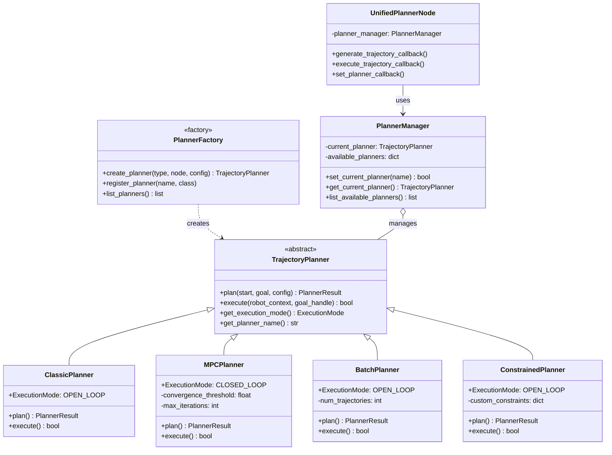
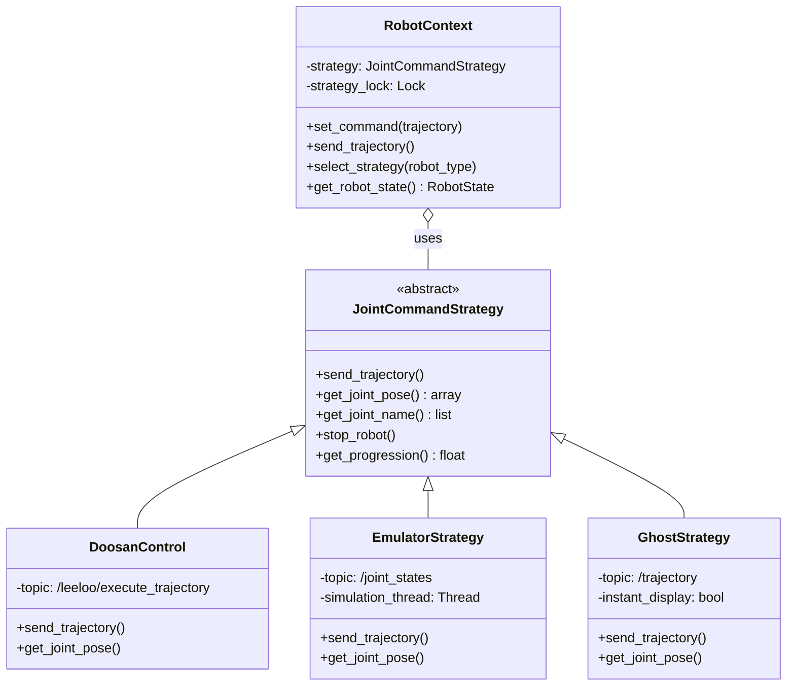
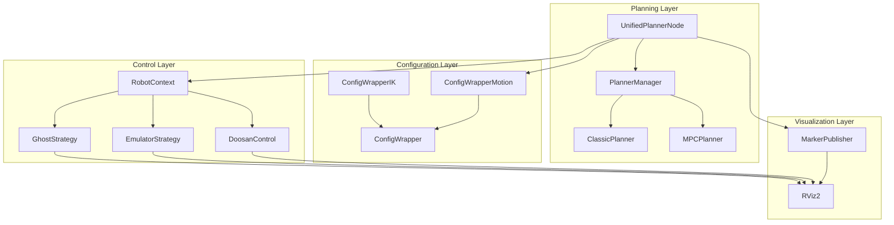

# Package architecture

## Overview
 
curobo_ros uses a modular, pattern-based architecture that separates concerns between planning, robot control, and visualization. The architecture supports:
 
- **Multiple planning strategies** (Classic, MPC, Batch, Constrained)
- **Multiple robot control strategies** (Real robot, Emulator, Ghost)
- **Dynamic switching** between strategies at runtime
- **Extensibility** for custom planners and robot controllers
 
---
 
## Unified Planner Architecture
 
The unified planner implements the **Strategy Pattern** to support multiple planning algorithms:
 

 
**Key Features:**
- **Strategy Pattern**: Easy to add new planners
- **Factory Pattern**: Centralized planner creation
- **Manager Pattern**: Runtime planner switching
- **Type-safe**: Enum-based planner selection
 
For details, see [Unified Planner Documentation](unified_planner.md).
 
---
 
## Robot Control Strategy Architecture
 
Robot control also uses the Strategy Pattern for different robot types:
 

 
**Key Features:**
- **Strategy Pattern**: Easy to add new robots
- **Thread-safe**: Lock-protected strategy switching
- **Runtime switching**: Change robot without restart
- **Ghost overlay**: Always-on trajectory preview
 
---
 
## Overall System Architecture
 

 
---
 
## Class diagramm