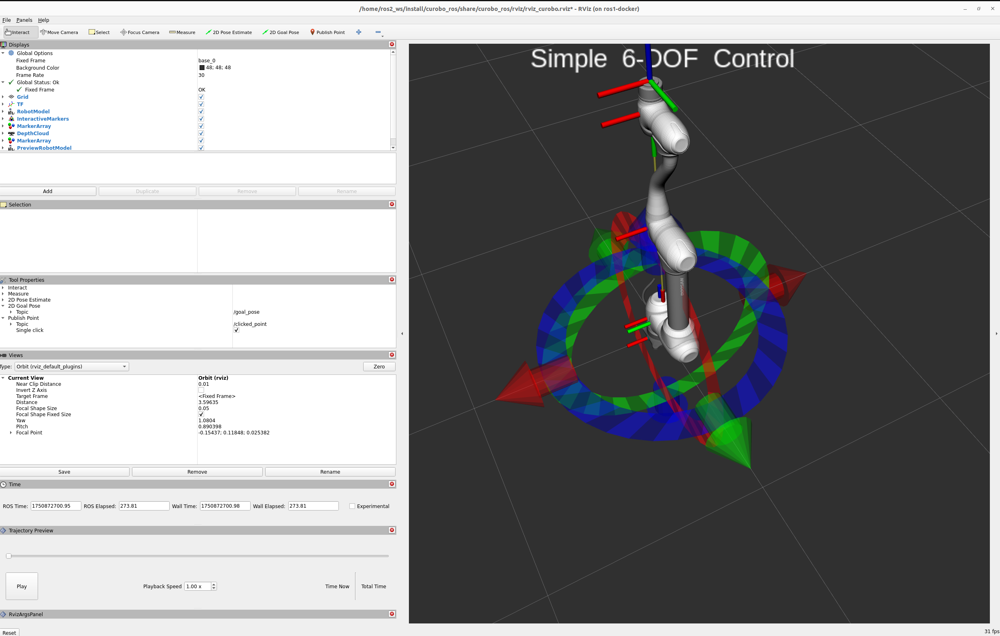
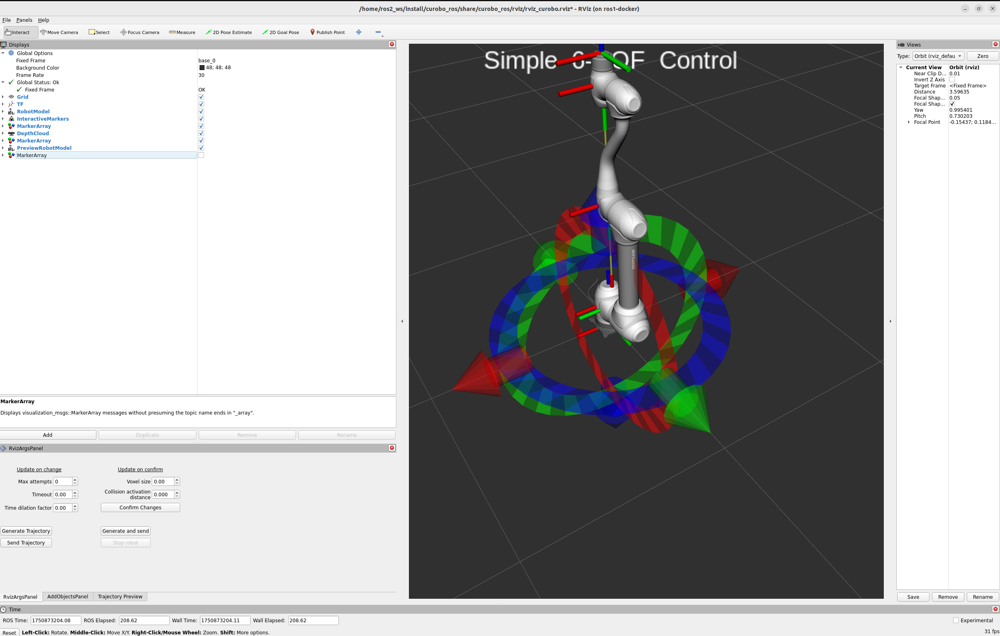
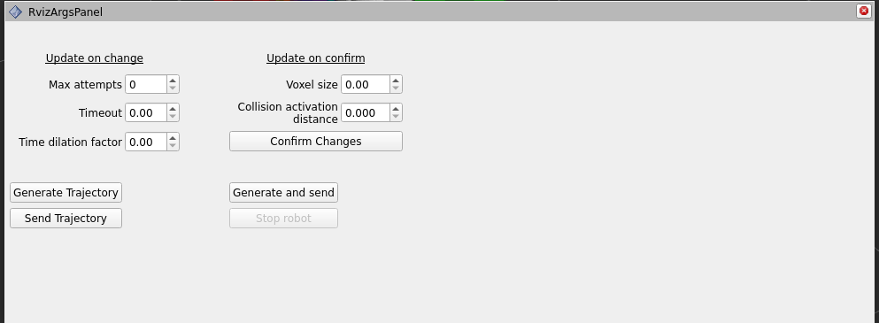
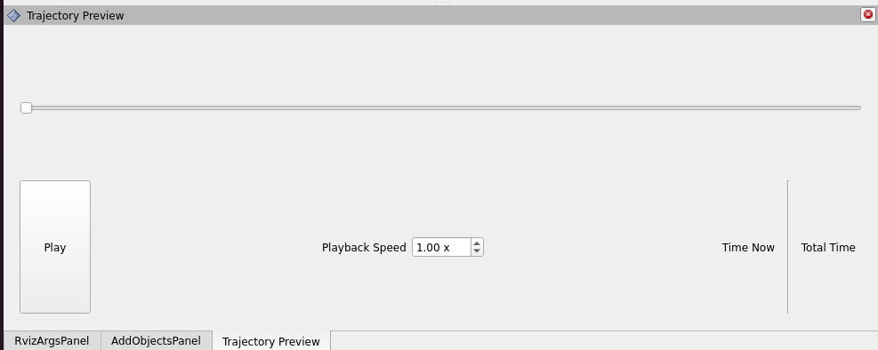
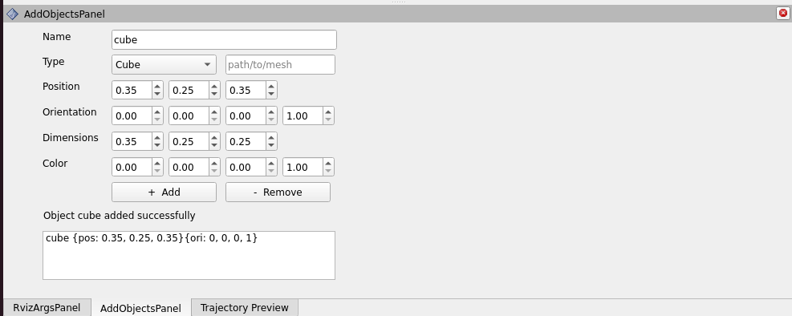

## RViz Plugin

The RViz interface is provided by the [curobo_rviz](https://github.com/Lab-CORO/curobo_rviz) package. It currently serves as a basic debugging tool, and is still a work in progress toward becoming more user-friendly.

---

## Launching the Interface

The RViz interface is launched via the `gen_traj.launch.py` launch file in `curobo_ros`. When starting the launch file, the interface will appear to freeze initially—this is expected behavior while Curobo completes its warmup phase. Once the warmup is finished, the interface becomes responsive and ready to use:

> Note: The default layout may appear cluttered or disorganized. A recommended layout is shown below for better usability:

---

## Interface Overview

### 🧭 Control Panel

The **Control Panel** allows you to interact with Curobo's services and actions. You can generate and execute trajectories using the interactive marker. Once you position the marker at the desired pose, you can initiate trajectory generation. Several parameters can be adjusted directly from this panel.

---

### 📈 Trajectory Visualization

This panel provides a timeline-based visualization of the generated trajectory. A "ghost" version of the robot animates the movement and velocity to help you inspect the planned motion.

---

### 📦 Object Manager

The **Object Manager** allows you to add and remove objects in the environment. Supported shapes include:
* Cubes
* Cylinders
* Spheres
* Capsules
* Meshes

Objects are currently represented as voxels. While object visualization in the RViz panel is not yet available, this feature is under development. To remove an object, select it from the list.

---