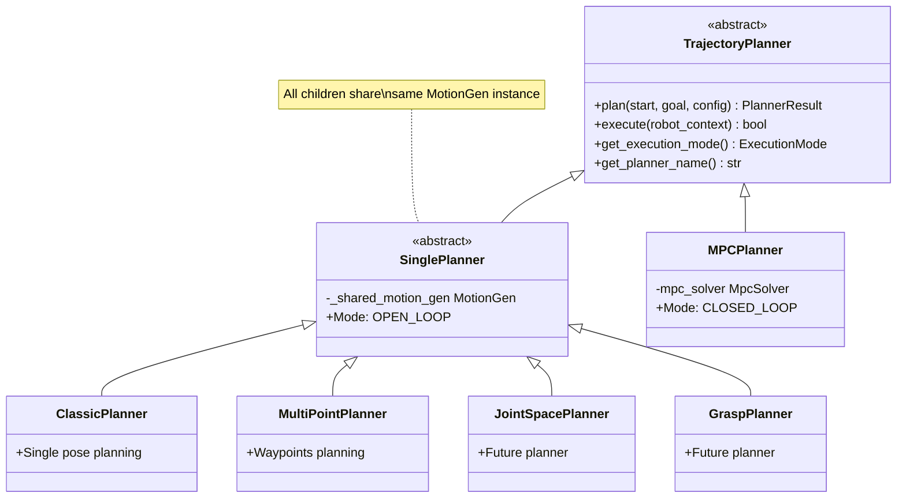
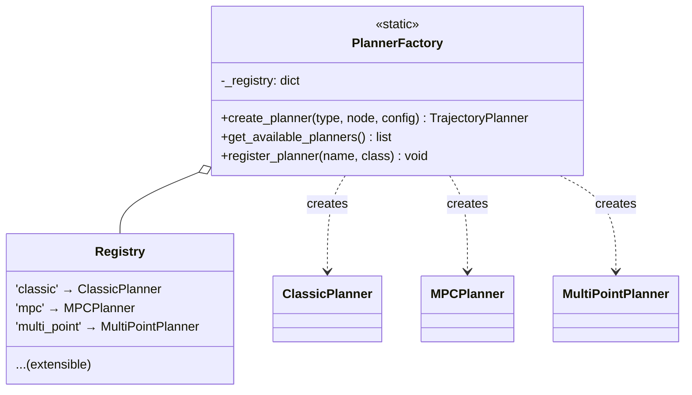
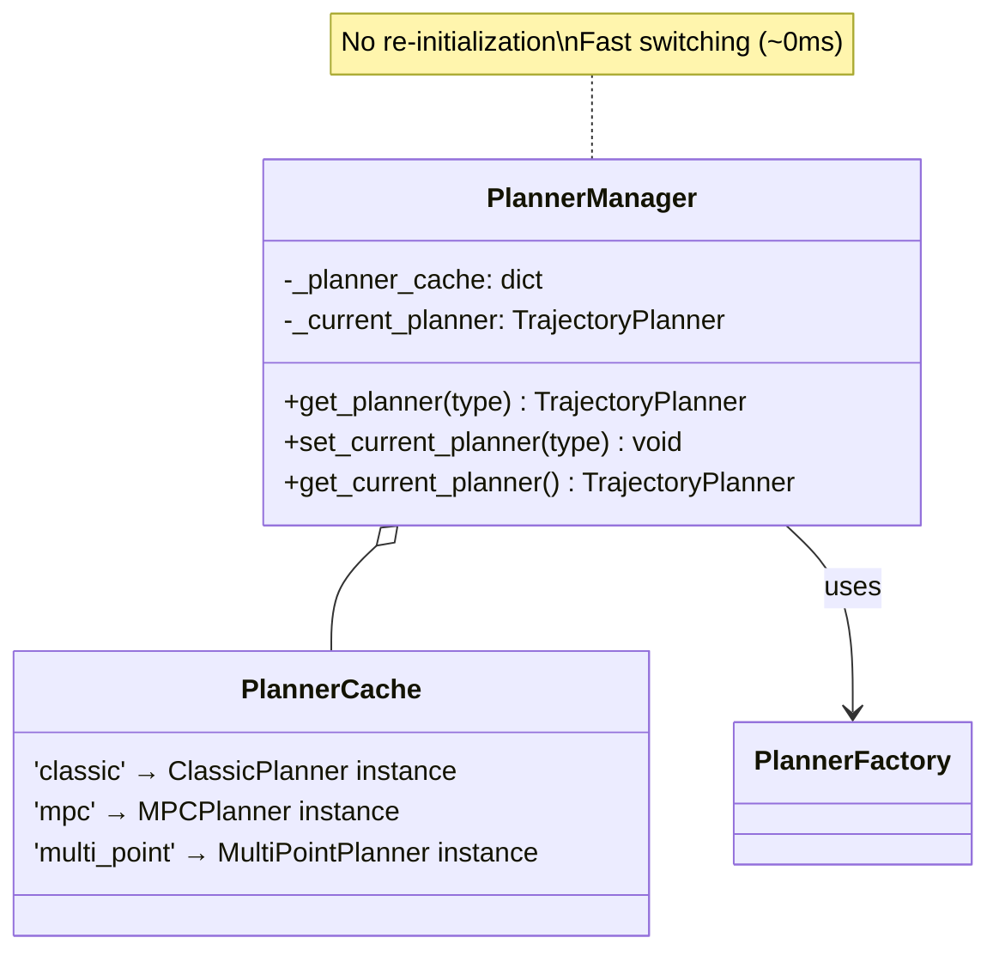
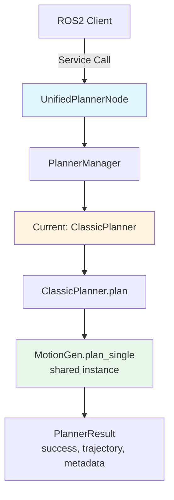
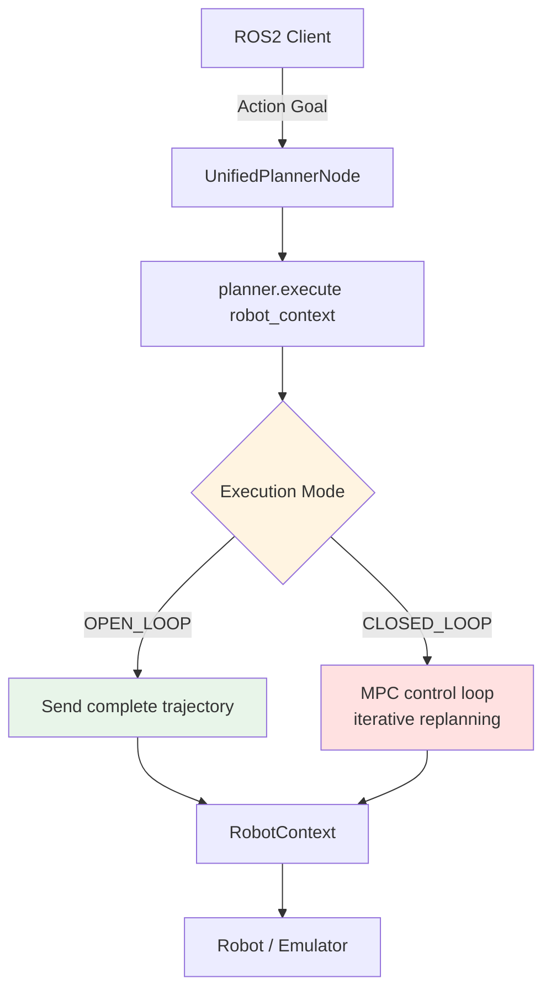
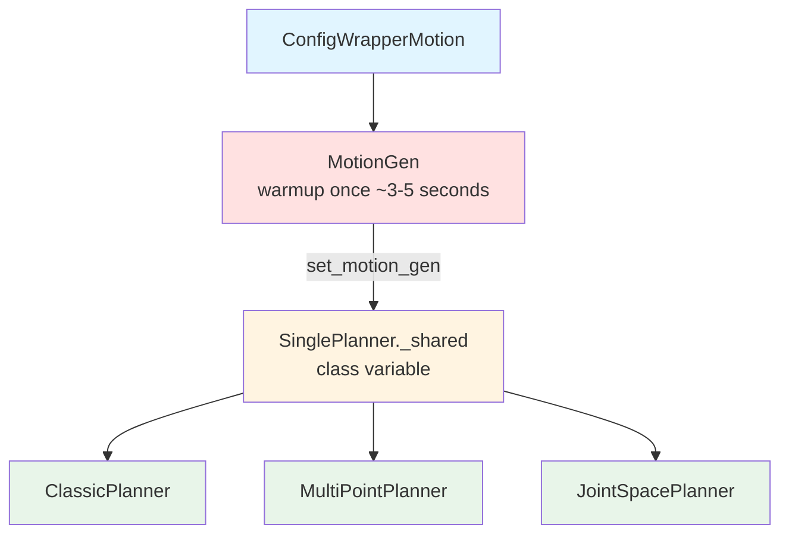
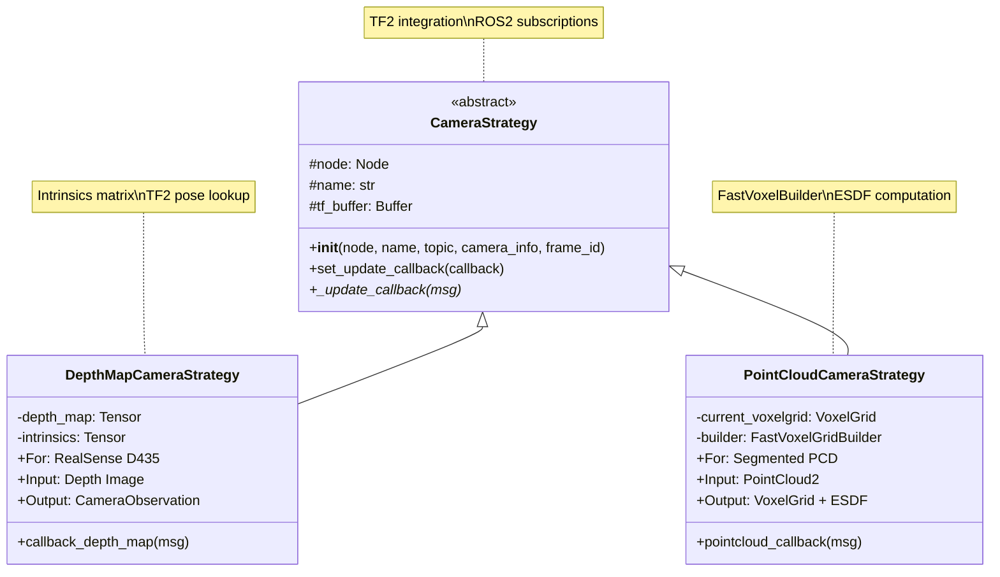
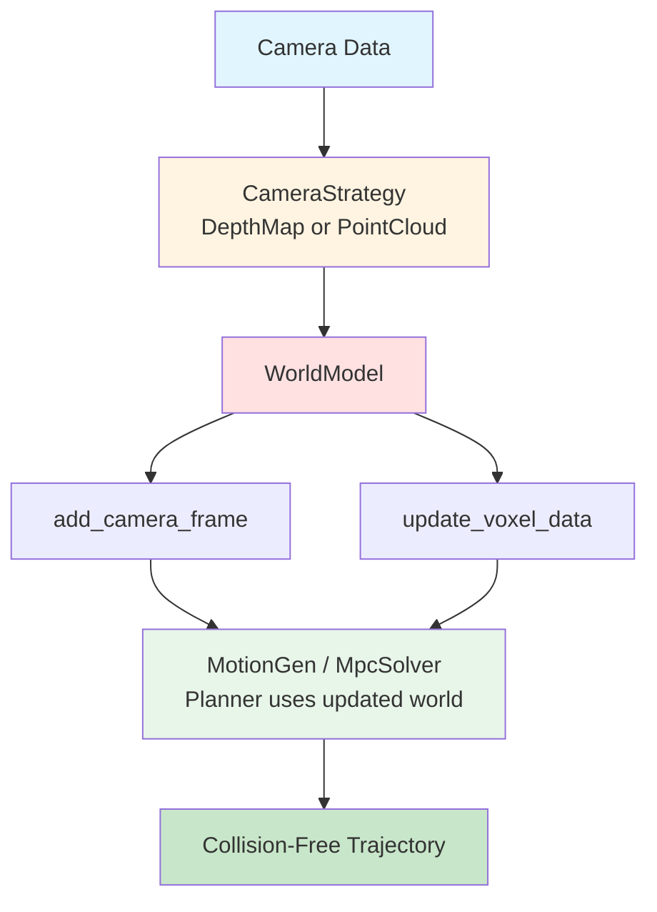

# Unified Planner Architecture

The Unified Planner Architecture provides a flexible framework for supporting multiple motion planning algorithms in curobo_ros. Using the Strategy Pattern, different planners can be dynamically selected and switched at runtime.

---

## 📐 Architecture Overview

### Class Hierarchy



### Execution Modes

**OPEN_LOOP (SinglePlanner children)**:
1. `plan()` - Generate complete trajectory
2. `execute()` - Send trajectory to robot
3. No feedback loop during execution

**CLOSED_LOOP (MPCPlanner)**:
1. `plan()` - Initialize MPC
2. `execute()` - Iterative: sense → plan → execute → repeat
3. Reactive to disturbances and moving targets

---

## 🏭 Factory Pattern

### PlannerFactory

Creates planner instances dynamically:



### PlannerManager

Manages planner lifecycle and caching:



**Benefits**:
- No re-initialization when switching planners
- All SinglePlanner children share same MotionGen (no warmup)
- Fast planner switching (~0ms overhead)

---

## 🎯 Available Planners

### 1. ClassicPlanner
**Type**: `classic` or `motion_gen`
**Base**: SinglePlanner
**Mode**: OPEN_LOOP

**Use case**: Single-shot trajectory to one goal pose
```python
# Plan to single pose
result = planner.plan(
    start_state=current_joints,
    goal_request=request,  # Uses request.target_pose
    config={'max_attempts': 2, 'timeout': 10.0}
)
```

**Features**:
- Fast planning (~10-50ms)
- Collision-free trajectories
- Smooth joint motion
- Single goal pose

### 2. MultiPointPlanner
**Type**: `multi_point`
**Base**: SinglePlanner
**Mode**: OPEN_LOOP

**Use case**: Trajectory through multiple waypoints
```python
# Plan through waypoints
result = planner.plan(
    start_state=current_joints,
    goal_request=request,  # Uses request.target_poses (list)
    config={'max_attempts': 2}
)
```

**Features**:
- Visit multiple poses in sequence
- Useful for pick-and-place
- Smooth transitions between waypoints
- All waypoints in one trajectory

### 3. MPCPlanner
**Type**: `mpc` or `model_predictive_control`
**Base**: TrajectoryPlanner (direct)
**Mode**: CLOSED_LOOP

**Use case**: Real-time reactive planning
```python
# MPC planning with feedback
result = planner.plan(
    start_state=current_joints,
    goal_request=request,
    robot_context=robot_context  # For real-time state
)
```

**Features**:
- Closed-loop control
- Reactive to disturbances
- Moving target tracking
- Real-time replanning

---

## 🔄 Data Flow

### Planning Flow



### Execution Flow



---

## 🎛️ ROS 2 API

### Services

#### Change Planner Type
```bash
# Switch to classic planner
ros2 service call /unified_planner/set_planner std_srvs/srv/Trigger
# Then set parameter
ros2 param set /unified_planner planner_type classic

# Or use combined approach (if service defined)
ros2 service call /unified_planner/set_planner curobo_msgs/srv/SetPlanner \
  "{planner_type: 'multi_point'}"
```

#### List Available Planners
```bash
ros2 service call /unified_planner/list_planners std_srvs/srv/Trigger
```

#### Generate Trajectory
```bash
# Single pose (Classic or MPC)
ros2 service call /unified_planner/generate_trajectory \
  curobo_msgs/srv/TrajectoryGeneration \
  "{target_pose: {position: {x: 0.5, y: 0.0, z: 0.4},
                  orientation: {w: 1.0, x: 0, y: 0, z: 0}}}"

# Multiple poses (MultiPoint)
ros2 service call /unified_planner/generate_trajectory \
  curobo_msgs/srv/TrajectoryGeneration \
  "{target_poses: [
    {position: {x: 0.3, y: 0.0, z: 0.5}, orientation: {w: 1, x: 0, y: 0, z: 0}},
    {position: {x: 0.5, y: 0.2, z: 0.3}, orientation: {w: 1, x: 0, y: 0, z: 0}}
  ]}"
```

### Parameters

```yaml
unified_planner:
  planner_type: "classic"  # classic, mpc, multi_point
  max_attempts: 2
  timeout: 10.0
  time_dilation_factor: 0.5
```

---

## 📊 Shared MotionGen Architecture

### Key Design Decision

All `SinglePlanner` children share the **same MotionGen instance**:



**Benefits**:
- Warmup only once (saves ~5 seconds per switch)
- Consistent world model across all planners
- Memory efficient
- Fast switching between planners

**Note**: MPCPlanner uses separate MpcSolver (different optimization approach)

---

## 🎨 Example Usage

### Python API

```python
from curobo_ros.planners import PlannerFactory, PlannerManager

# Option 1: Direct creation
classic = PlannerFactory.create_planner('classic', node, config)
result = classic.plan(start, goal, config)

# Option 2: Using Manager (with caching)
manager = PlannerManager(node, config)

# Use classic
manager.set_current_planner('classic')
result = manager.get_current_planner().plan(start, goal, config)

# Switch to multi-point
manager.set_current_planner('multi_point')
result = manager.get_current_planner().plan(start, goals, config)
```

### Launch File

```python
from launch import LaunchDescription
from launch_ros.actions import Node

def generate_launch_description():
    return LaunchDescription([
        Node(
            package='curobo_ros',
            executable='unified_planner',
            parameters=[{
                'planner_type': 'classic',  # Default planner
                'robot_config': '/path/to/robot.yaml',
                'enable_mpc': True,
            }]
        )
    ])
```

---

## 🎯 When to Use Each Planner

| Scenario | Recommended Planner | Reason |
|----------|-------------------|---------|
| Single goal pose | **Classic** | Fast, simple, reliable |
| Pick-and-place | **MultiPoint** | Natural waypoint sequence |
| Moving target | **MPC** | Real-time reactive |
| Static environment | **Classic** | Most efficient |
| Dynamic obstacles | **MPC** | Closed-loop avoidance |
| High precision path | **MultiPoint** | Control intermediate poses |
| Fast computation needed | **Classic** | Fastest planning |
| Disturbance rejection | **MPC** | Feedback control |

---

## 📷 Camera Architecture

### Overview

The camera system provides dynamic obstacle detection using the **Strategy Pattern** to support different camera types.



### Strategy Implementations

#### 1. DepthMapCameraStrategy
**Use case**: RGB-D cameras (Intel RealSense, Azure Kinect)

**Data Flow**:
```mermaid
flowchart TD
    A[Depth Camera<br/>RealSense D435] --> B1[/camera/depth/image_rect_raw]
    A --> B2[/camera/depth/camera_info]

    B1 --> C[DepthMapCameraStrategy]
    B2 --> C

    C --> D1[1. Get intrinsics from CameraInfo<br/>Extract K matrix fx,fy,cx,cy<br/>Create 3x3 intrinsics tensor]
    D1 --> D2[2. Convert depth image to tensor<br/>16UC1 mm → float m<br/>32FC1 → float m<br/>Move to GPU]
    D2 --> D3[3. Lookup camera pose via TF2<br/>Transform: base_link → camera<br/>Convert to cuRobo format]
    D3 --> D4[4. Create CameraObservation<br/>depth_image + intrinsics + pose]

    D4 --> E[WorldModel]
    E --> F1[add_camera_frame]
    E --> F2[process_frames]
    E --> F3[update_blox_hashes]

    style A fill:#e1f5ff
    style C fill:#fff4e1
    style E fill:#e8f5e9
```

**Configuration**:
```yaml
camera:
  type: "depth_map"
  name: "realsense_d435"
  topic: "/camera/depth/image_rect_raw"
  camera_info_topic: "/camera/depth/camera_info"
  frame_id: "camera_depth_optical_frame"
```

**Features**:
- Automatic intrinsics extraction
- TF2-based pose tracking
- Real-time depth processing
- GPU-accelerated

#### 2. PointCloudCameraStrategy
**Use case**: Pre-processed point clouds (robot segmentation)

**Data Flow**:
```mermaid
flowchart TD
    A[Point Cloud<br/>Segmented] --> B[/masked_point_cloud<br/>PointCloud2]

    B --> C[PointCloudCameraStrategy]

    C --> D1[1. Convert PointCloud2 → NumPy<br/>Extract XYZ coordinates<br/>Filter NaN/invalid points]
    D1 --> D2[2. FastVoxelGridBuilder<br/>Discretize points to voxels<br/>Fixed grid 100x100x100<br/>Vectorized operations]
    D2 --> D3[3. Compute ESDF<br/>Distance transform<br/>Positive = inside obstacle<br/>Negative = free space]
    D3 --> D4[4. Create VoxelGrid<br/>Feature tensor ESDF<br/>Grid dimensions & voxel_size<br/>Pose origin]

    D4 --> E[WorldModel]
    E --> F1[update_voxel_data]
    E --> F2[load_collision_model]

    style A fill:#e1f5ff
    style C fill:#fff4e1
    style E fill:#e8f5e9
```

**Configuration**:
```yaml
camera:
  type: "point_cloud"
  name: "segmented_obstacles"
  topic: "/masked_point_cloud"
  frame_id: "base_link"
  voxel_size: 0.02        # 2cm resolution
  grid_size: [102, 102, 102]
  origin: [-1.0, -1.0, -1.0]
  use_gpu: false          # CPU or GPU processing
```

**Features**:
- Orthographic projection
- ESDF computation for smooth collision gradients
- CPU (scipy) or GPU (PyTorch) acceleration
- Vectorized operations (no Python loops)

### Performance Comparison

| Strategy | Input | Processing | Typical Latency | Use Case |
|----------|-------|------------|-----------------|----------|
| **DepthMap** | Depth Image | GPU (cuRobo BLOX) | ~5-10ms | RealSense, Kinect |
| **PointCloud (CPU)** | PointCloud2 | CPU (scipy EDT) | ~20-50ms | General PCD |
| **PointCloud (GPU)** | PointCloud2 | GPU (PyTorch) | ~10-20ms | High-frequency PCD |

### Integration with Planning



**Key Points**:
- Camera updates happen **before** planning
- WorldModel maintains obstacle representation
- Planners automatically use updated collision world
- No code changes needed in planner logic

### Adding Custom Camera Strategies

```python
from curobo_ros.cameras import CameraStrategy

class MyCustomCameraStrategy(CameraStrategy):
    def __init__(self, node, name, topic, camera_info, frame_id):
        super().__init__(node, name, topic, camera_info, frame_id)

        # Subscribe to custom topic
        self.subscription = node.create_subscription(
            CustomMsg, topic, self._update_callback, 10)

    def _update_callback(self, msg):
        # Process custom message
        # Update world model
        pass
```

---

## 🔗 Related Documentation

- **[Parameters Guide](parameters.md)** - Configure planner behavior
- **[MPC Implementation](mpc-implementation.md)** - Deep dive into MPC
- **[ROS Interfaces](ros-interfaces.md)** - Complete API reference
- **[Tutorial: MPC Planner](../tutorials/05-mpc-planner.md)** - Step-by-step MPC usage
- **[Tutorial: Point Cloud Detection](../tutorials/07-pointcloud-detection.md)** - Camera integration tutorial
- **[Example: Camera Integration](../tutorials/examples/camera-integration.md)** - Complete camera setup

---

## 📝 Adding Custom Planners

### Step 1: Create Planner Class

```python
from curobo_ros.planners import SinglePlanner, PlannerResult

class MyCustomPlanner(SinglePlanner):
    def get_planner_name(self):
        return "My Custom Planner"

    def _plan_trajectory(self, start_state, goal_request, config):
        # Your planning logic using self._shared_motion_gen
        result = self._shared_motion_gen.plan_single(...)
        return result
```

### Step 2: Register with Factory

```python
from curobo_ros.planners import PlannerFactory

PlannerFactory.register_planner('my_custom', MyCustomPlanner)
```

### Step 3: Use It

```bash
ros2 param set /unified_planner planner_type my_custom
```

---

## 🔗 Related Documentation

- **[System Architecture](architecture.md)** - Overall system design and components
- **[Parameters Guide](parameters.md)** - Configure planner behavior
- **[MPC Implementation](mpc-implementation.md)** - Deep dive into MPC
- **[ROS Interfaces](ros-interfaces.md)** - Complete API reference
- **[Tutorial: MPC Planner](../tutorials/05-mpc-planner.md)** - Step-by-step MPC usage
- **[Tutorial: Point Cloud Detection](../tutorials/07-pointcloud-detection.md)** - Camera integration tutorial
- **[Example: Camera Integration](../tutorials/examples/camera-integration.md)** - Complete camera setup
- **[Example: Doosan M1013](../tutorials/examples/doosan-m1013.md)** - Real robot integration

---

**Status**: ✅ Fully Implemented (Classic, MultiPoint planners operational, MPC framework ready)
