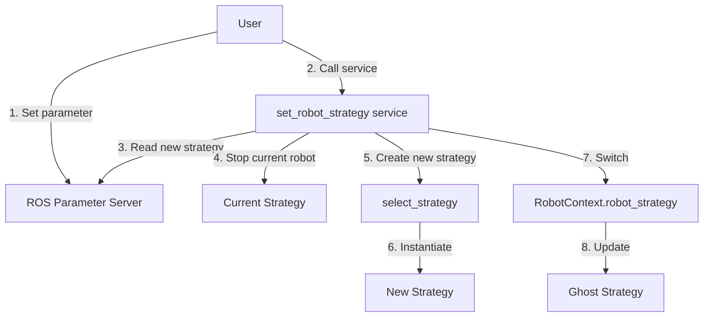

# Tutorial: Dynamic Robot Strategy Switching

This tutorial explains how to dynamically switch between different robot control strategies without restarting the node. You'll learn how to:

- Switch between different robots (Doosan, UR5e, etc.)
- Use emulator mode for testing without hardware
- Switch to ghost mode for visualization only
- Implement new robot strategies

---

## Overview

The `RobotContext` system allows you to **dynamically change** the robot control strategy **without restarting the node**. This enables seamless switching between different robot types (Doosan, UR5e, emulator, etc.) or visualization mode (ghost) on the fly.

**Key Benefits:**
- No node restart required
- Thread-safe switching
- Automatic rollback on failure
- Support for multiple robot types
- Easy simulation/real hardware switching

---

## Available Strategies

| Strategy | Description | Status |
|----------|-------------|--------|
| **`doosan_m1013`** | Control real Doosan M1013 robot | ✅ Implemented |
| **`emulator`** | Software robot emulator (publishes to `/emulator/joint_states`) | ✅ Implemented |
| **`ghost`** | Visualization-only mode (topic `/trajectory`) | ✅ Always active |
| **`ur5e`** | Universal Robots UR5e control | ⚠️ Placeholder (not yet implemented) |

---

## Usage

### 1. Check Current Strategy

```bash
# Via ROS service
ros2 service call /curobo_gen_traj/get_robot_strategy std_srvs/srv/Trigger
```

**Response:**
```yaml
success: true
message: 'doosan_m1013'  # Current strategy
```

### 2. Switch Strategy

To change strategy, you need to:
1. **Modify the ROS parameter** `robot_type`
2. **Call the service** to activate the switch

```bash
# Step 1: Modify the parameter
ros2 param set /curobo_gen_traj robot_type "emulator"

# Step 2: Trigger the switch
ros2 service call /curobo_gen_traj/set_robot_strategy std_srvs/srv/Trigger
```

**Response:**
```yaml
success: true
message: "Strategy switched from 'doosan_m1013' to 'emulator'"
```

### 3. Example Switches

#### Switch from Doosan to Ghost Mode (Visualization Only)

```bash
# 1. Set parameter
ros2 param set /curobo_gen_traj robot_type "ghost"

# 2. Apply change
ros2 service call /curobo_gen_traj/set_robot_strategy std_srvs/srv/Trigger
```

#### Switch from Real Robot to Emulator

```bash
# 1. Set parameter
ros2 param set /curobo_gen_traj robot_type "emulator"

# 2. Apply change
ros2 service call /curobo_gen_traj/set_robot_strategy std_srvs/srv/Trigger
```

---

## Complete Workflow

### Bash Script for Automatic Switching

```bash
#!/bin/bash

# Script to dynamically switch robot strategy

NODE_NAME="/curobo_gen_traj"
NEW_STRATEGY="$1"

if [ -z "$NEW_STRATEGY" ]; then
    echo "Usage: $0 <strategy_name>"
    echo "Available strategies: doosan_m1013, ur5e, emulator, ghost"
    exit 1
fi

echo "🔄 Switching to strategy: $NEW_STRATEGY"

# 1. Check current strategy
echo "📊 Current strategy:"
ros2 service call ${NODE_NAME}/get_robot_strategy std_srvs/srv/Trigger

# 2. Set parameter
echo "⚙️  Setting parameter robot_type to $NEW_STRATEGY..."
ros2 param set ${NODE_NAME} robot_type "$NEW_STRATEGY"

# 3. Apply change
echo "🔄 Applying strategy change..."
RESULT=$(ros2 service call ${NODE_NAME}/set_robot_strategy std_srvs/srv/Trigger)

echo "$RESULT"

# 4. Verify result
if echo "$RESULT" | grep -q "success: true"; then
    echo "✅ Strategy switched successfully!"
else
    echo "❌ Failed to switch strategy"
    exit 1
fi
```

**Usage:**
```bash
chmod +x switch_strategy.sh
./switch_strategy.sh emulator
```

---

## Python Example

```python
#!/usr/bin/env python3
import rclpy
from rclpy.node import Node
from std_srvs.srv import Trigger
from rclpy.parameter import Parameter
import time


class StrategyManager(Node):
    def __init__(self):
        super().__init__('strategy_manager')

        # Service clients
        self.get_strategy_client = self.create_client(
            Trigger,
            '/curobo_gen_traj/get_robot_strategy'
        )
        self.set_strategy_client = self.create_client(
            Trigger,
            '/curobo_gen_traj/set_robot_strategy'
        )

        # Wait for services
        self.get_strategy_client.wait_for_service(timeout_sec=5.0)
        self.set_strategy_client.wait_for_service(timeout_sec=5.0)

    def get_current_strategy(self):
        """Get current strategy"""
        request = Trigger.Request()
        future = self.get_strategy_client.call_async(request)
        rclpy.spin_until_future_complete(self, future, timeout_sec=5.0)

        if future.result() is not None:
            response = future.result()
            if response.success:
                return response.message
        return None

    def switch_strategy(self, new_strategy: str):
        """
        Switch robot control strategy

        Args:
            new_strategy: Name of new strategy
                         ("doosan_m1013", "ur5e", "emulator", "ghost")

        Returns:
            (success, message): Tuple with status and message
        """
        # 1. Check current strategy
        current = self.get_current_strategy()
        self.get_logger().info(f"Current strategy: {current}")

        if current == new_strategy:
            self.get_logger().info(f"Already using strategy: {new_strategy}")
            return (True, f"Already using {new_strategy}")

        # 2. Set parameter via subprocess
        import subprocess
        result = subprocess.run(
            ['ros2', 'param', 'set', '/curobo_gen_traj', 'robot_type', new_strategy],
            capture_output=True,
            text=True
        )

        if result.returncode != 0:
            error_msg = f"Failed to set parameter: {result.stderr}"
            self.get_logger().error(error_msg)
            return (False, error_msg)

        self.get_logger().info(f"Parameter set to: {new_strategy}")
        time.sleep(0.5)  # Allow time for parameter update

        # 3. Call switch service
        request = Trigger.Request()
        future = self.set_strategy_client.call_async(request)
        rclpy.spin_until_future_complete(self, future, timeout_sec=10.0)

        if future.result() is not None:
            response = future.result()
            if response.success:
                self.get_logger().info(f"✅ {response.message}")
                return (True, response.message)
            else:
                self.get_logger().error(f"❌ {response.message}")
                return (False, response.message)
        else:
            error_msg = "Service call failed or timed out"
            self.get_logger().error(error_msg)
            return (False, error_msg)


def main():
    rclpy.init()
    manager = StrategyManager()

    # Example: Switch to ghost mode
    print("🔄 Switching to ghost mode...")
    success, message = manager.switch_strategy("ghost")
    print(f"Result: {message}")

    time.sleep(2)

    # Example: Switch back to Doosan
    print("🔄 Switching back to doosan_m1013...")
    success, message = manager.switch_strategy("doosan_m1013")
    print(f"Result: {message}")

    manager.destroy_node()
    rclpy.shutdown()


if __name__ == '__main__':
    main()
```

---

## Emulator Strategy

The **`emulator`** strategy is a complete software robot emulator that allows testing and visualizing trajectories **without physical hardware**.

### How It Works

The emulator:
1. ✅ **Publishes to `/emulator/joint_states`** - Standard ROS topic for joint states
2. ✅ **Simulates trajectory execution** - Dedicated thread for time progression
3. ✅ **Compatible with RViz** - Robot appears and moves in RViz
4. ✅ **No hardware required** - Runs entirely in software

### RViz Configuration

To see the emulator in RViz, ensure:

```yaml
# In your .rviz file
RobotModel:
  Description Topic: /robot_description

TF:
  Enabled: true
  Frame Timeout: 15
```

The robot will be visible and move according to generated trajectories.

### Typical Usage

```bash
# 1. Start with emulator
ros2 param set /curobo_gen_traj robot_type "emulator"
ros2 service call /curobo_gen_traj/set_robot_strategy std_srvs/srv/Trigger

# 2. Generate a trajectory
ros2 service call /curobo_gen_traj/generate_trajectory curobo_msgs/srv/TrajectoryGeneration \
  "{target_pose: {position: {x: 0.5, y: 0.2, z: 0.3}, orientation: {w: 1.0, x: 0, y: 0, z: 0}}}"

# 3. Execute (robot moves in RViz)
ros2 action send_goal /curobo_gen_traj/send_trajectrory curobo_msgs/action/SendTrajectory "{}"

# 4. Observe in RViz
rviz2
```

### Topics Published

| Topic | Type | Rate | Description |
|-------|------|------|-------------|
| `/emulator/joint_states` | `sensor_msgs/JointState` | Variable (depends on `dt`) | Simulated joint states |

### Emulator Logs

```
[INFO] [curobo_gen_traj]: ✅ Emulator strategy initialized - Publishing to /emulator/joint_states
[INFO] [curobo_gen_traj]: 🚀 Emulator: Starting trajectory execution (250 points)
[INFO] [curobo_gen_traj]: Emulator: 20.0% complete (50/250) - 1.00s
[INFO] [curobo_gen_traj]: Emulator: 40.0% complete (100/250) - 2.00s
[INFO] [curobo_gen_traj]: Emulator: 60.0% complete (150/250) - 3.00s
[INFO] [curobo_gen_traj]: Emulator: 80.0% complete (200/250) - 4.00s
[INFO] [curobo_gen_traj]: ✅ Emulator: Trajectory completed in 5.00s
```

### Advantages of Emulator

- ✅ **Safe testing** - No risk to hardware
- ✅ **Rapid development** - No need for robot access
- ✅ **Demonstrations** - Show system without robot
- ✅ **CI/CD** - Integration in automated pipelines
- ✅ **Training** - Learn without physical robot

### Differences: Emulator vs Ghost

| Aspect | Emulator | Ghost |
|--------|----------|-------|
| **Topic** | `/emulator/joint_states` | `/trajectory` |
| **Purpose** | Simulate robot | Visualize trajectory |
| **Execution** | Progressive over time | Instantaneous |
| **RViz Display** | Main robot | Preview robot (ghost) |
| **Use Case** | Testing without hardware | Trajectory preview |

---

## Internal Architecture

### How Switching Works



### Switching Sequence

1. **Parameter updated**: User modifies `robot_type`
2. **Service called**: `/set_robot_strategy` is triggered
3. **Lock acquired**: Thread-safety via `strategy_lock`
4. **Robot stopped**: Current strategy stops the robot
5. **New strategy created**: `select_strategy()` instantiates new strategy
6. **Strategy switched**: `robot_strategy` points to new instance
7. **Ghost reset**: For RViz visualization
8. **Lock released**: Other threads can access

### Thread Safety

All methods using `robot_strategy` are protected by `strategy_lock`:

```python
with self.strategy_lock:
    if self.robot_strategy is not None:
        result = self.robot_strategy.some_method()
```

**Protected methods:**
- `set_command()`
- `get_joint_pose()`
- `get_joint_name()`
- `stop_robot()`
- `get_progression()`
- `send_trajectrory()`
- `get_send_to_robot()`

---

## Special Behaviors

### Unimplemented Strategy

If you select an unimplemented strategy (e.g., `ur5e` currently), the system:

1. **Returns an error** via the service
2. **Keeps current strategy** (automatic rollback)
3. **Logs an error message**

**Example:**
```bash
$ ros2 service call /curobo_gen_traj/set_robot_strategy std_srvs/srv/Trigger
```

**Response:**
```yaml
success: false
message: "Strategy 'ur5e' is not implemented yet"
```

### Ghost Mode

The `ghost` mode is **always active** in parallel for RViz visualization, regardless of the actual control strategy.

---

## Use Cases

### 1. Development Without Physical Robot

```bash
# Develop and test without robot
ros2 param set /curobo_gen_traj robot_type "ghost"
ros2 service call /curobo_gen_traj/set_robot_strategy std_srvs/srv/Trigger

# Everything works, but only visualization in RViz
```

### 2. Integration Testing

```bash
# Test with emulator first
ros2 param set /curobo_gen_traj robot_type "emulator"
ros2 service call /curobo_gen_traj/set_robot_strategy std_srvs/srv/Trigger

# Once validated, switch to real robot
ros2 param set /curobo_gen_traj robot_type "doosan_m1013"
ros2 service call /curobo_gen_traj/set_robot_strategy std_srvs/srv/Trigger
```

### 3. Multi-Robot Setup

```bash
# Switch between different robots without restarting
# Robot 1 (Doosan)
ros2 param set /curobo_gen_traj robot_type "doosan_m1013"
ros2 service call /curobo_gen_traj/set_robot_strategy std_srvs/srv/Trigger

# ... work with Doosan ...

# Robot 2 (UR5e)
ros2 param set /curobo_gen_traj robot_type "ur5e"
ros2 service call /curobo_gen_traj/set_robot_strategy std_srvs/srv/Trigger
```

---

## Debugging

### View Logs

```bash
# Real-time logs
ros2 run rqt_console rqt_console

# Filter by node
# Filter: /curobo_gen_traj
```

**Typical logs during switch:**
```
[INFO] [curobo_gen_traj]: Switching strategy from 'doosan_m1013' to 'ghost'...
[INFO] [curobo_gen_traj]: Previous robot strategy stopped
[INFO] [curobo_gen_traj]: ✅ Strategy switched from 'doosan_m1013' to 'ghost'
```

### Check Available Services

```bash
# List all services for node
ros2 service list | grep curobo_gen_traj

# Should include:
# /curobo_gen_traj/set_robot_strategy
# /curobo_gen_traj/get_robot_strategy
```

### Check Parameters

```bash
# List parameters
ros2 param list | grep robot

# Should include:
# /curobo_gen_traj:
#   robot_type
```

---

## Adding a New Strategy

To add a new strategy (e.g., UR5e):

### 1. Create Strategy Class

Create `curobo_ros/robot/ur5e_strategy.py`:

```python
from curobo_ros.robot.joint_control_strategy import JointCommandStrategy, RobotState
from trajectory_msgs.msg import JointTrajectory
# ... other imports

class UR5eControl(JointCommandStrategy):
    '''
    Strategy to control UR5e robot
    '''

    def __init__(self, node, dt):
        super().__init__(node, dt)
        # UR5e-specific initialization
        self.pub_trajectory = node.create_publisher(
            JointTrajectory,
            '/ur5e/trajectory',
            10
        )
        # ... etc

    def send_trajectrory(self):
        # UR5e-specific implementation
        pass

    def get_joint_pose(self):
        # UR5e-specific implementation
        pass

    # ... Implement all abstract methods
```

### 2. Add to select_strategy

Modify `robot_context.py`:

```python
def select_strategy(self, node, time_dilation_factor):
    robot_type = node.get_parameter('robot_type').get_parameter_value().string_value
    match robot_type:
        case "doosan_m1013":
            from curobo_ros.robot.doosan_strategy import DoosanControl
            robot_strategy = DoosanControl(node, time_dilation_factor)
        case "ur5e":
            from curobo_ros.robot.ur5e_strategy import UR5eControl  # ✨ New
            robot_strategy = UR5eControl(node, time_dilation_factor)  # ✨ New
        case "emulator":
            from curobo_ros.robot.emulator_strategy import EmulatorControl
            robot_strategy = EmulatorControl(node, time_dilation_factor)
        case _:
            robot_strategy = None

    return robot_strategy
```

### 3. Test

```bash
# Test the switch
ros2 param set /curobo_gen_traj robot_type "ur5e"
ros2 service call /curobo_gen_traj/set_robot_strategy std_srvs/srv/Trigger
```

---

## Limitations and Precautions

### ⚠️ Robot Stop

The robot is **automatically stopped** when switching strategies. Ensure:
- Robot is in a safe position
- No trajectory is currently executing
- Workspace is clear

### ⚠️ Strategy-Specific Parameters

Some strategies may require **specific parameters**:
- Different ROS topics
- Different URDF configurations
- Different control parameters

**Recommendation:** Verify parameters before switching strategies.

### ⚠️ Command State

During switch:
- Current commands are **lost**
- Trajectory buffer is **cleared**
- Progression is **reset to 0**

---

## Summary

**You've learned:**

- ✅ How to switch robot strategies dynamically
- ✅ Using emulator for testing without hardware
- ✅ Difference between emulator and ghost modes
- ✅ How to implement new robot strategies
- ✅ Thread-safe switching mechanism

**Key advantages:**
- No node restart needed
- Thread-safe operation
- Automatic rollback on errors
- Easy simulation/hardware switching

---

## Next Steps

- **[Your First Trajectory](1_first_trajectory.md)** - Generate trajectories with different strategies
- **[Adding Your Robot](2_adding_your_robot.md)** - Create configuration for your robot
- **[Architecture](../concepts/architecture.md)** - Understand system architecture

---

## Reference

- **Service definition:** `std_srvs/srv/Trigger`
- **Implementation:** `curobo_ros/robot/robot_context.py`
- **Available strategies:** `curobo_ros/robot/`
- **Parameter:** `robot_type` (string)
