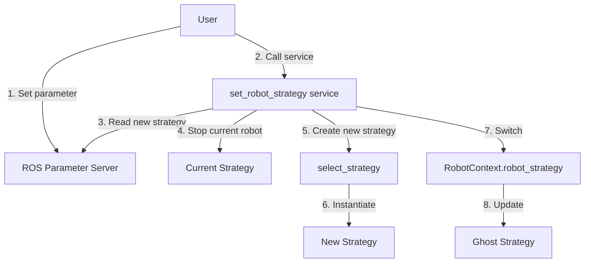

# Changement dynamique de stratégie de contrôle robot

## 📋 Vue d'ensemble

Le système `RobotContext` permet de **changer dynamiquement** la stratégie de contrôle du robot **sans redémarrer le node**. Cela permet de basculer entre différents types de robots (Doosan, UR5e, émulateur, etc.) ou de passer en mode simulation (ghost) à la volée.

---

## 🎯 Stratégies disponibles

| Stratégie | Description | Status |
|-----------|-------------|--------|
| **`doosan_m1013`** | Contrôle du robot Doosan M1013 réel | ✅ Implémenté |
| **`emulator`** | Émulateur de robot (publie sur `/joint_states` pour RViz) | ✅ Implémenté |
| **`ur5e`** | Contrôle du robot Universal Robots UR5e | ⚠️ À implémenter |
| **`ghost`** | Mode visualisation trajectoire uniquement (topic `/trajectory`) | ✅ Disponible |

---

## 🚀 Utilisation

### 1. Vérifier la stratégie actuelle

```bash
# Via service ROS
ros2 service call /curobo_gen_traj/get_robot_strategy std_srvs/srv/Trigger
```

**Response:**
```yaml
success: true
message: 'doosan_m1013'  # Stratégie actuelle
```

### 2. Changer de stratégie

Pour changer de stratégie, il faut :
1. **Modifier le paramètre ROS** `robot_type`
2. **Appeler le service** de changement de stratégie

```bash
# Étape 1: Modifier le paramètre
ros2 param set /curobo_gen_traj robot_type "ur5e"

# Étape 2: Activer le changement
ros2 service call /curobo_gen_traj/set_robot_strategy std_srvs/srv/Trigger
```

**Response:**
```yaml
success: true
message: "Strategy switched from 'doosan_m1013' to 'ur5e'"
```

### 3. Exemples de changements

#### Passer de Doosan à mode Ghost (visualisation seulement)

```bash
# 1. Modifier le paramètre
ros2 param set /curobo_gen_traj robot_type "ghost"

# 2. Appliquer le changement
ros2 service call /curobo_gen_traj/set_robot_strategy std_srvs/srv/Trigger
```

#### Passer d'un robot réel à l'émulateur

```bash
# 1. Modifier le paramètre
ros2 param set /curobo_gen_traj robot_type "emulator"

# 2. Appliquer le changement
ros2 service call /curobo_gen_traj/set_robot_strategy std_srvs/srv/Trigger
```

---

## 🔧 Workflow complet

### Script Bash pour changement automatique

```bash
#!/bin/bash

# Script pour changer de stratégie robot dynamiquement

NODE_NAME="/curobo_gen_traj"
NEW_STRATEGY="$1"

if [ -z "$NEW_STRATEGY" ]; then
    echo "Usage: $0 <strategy_name>"
    echo "Available strategies: doosan_m1013, ur5e, emulator, ghost"
    exit 1
fi

echo "🔄 Switching to strategy: $NEW_STRATEGY"

# 1. Vérifier la stratégie actuelle
echo "📊 Current strategy:"
ros2 service call ${NODE_NAME}/get_robot_strategy std_srvs/srv/Trigger

# 2. Modifier le paramètre
echo "⚙️  Setting parameter robot_type to $NEW_STRATEGY..."
ros2 param set ${NODE_NAME} robot_type "$NEW_STRATEGY"

# 3. Appliquer le changement
echo "🔄 Applying strategy change..."
RESULT=$(ros2 service call ${NODE_NAME}/set_robot_strategy std_srvs/srv/Trigger)

echo "$RESULT"

# 4. Vérifier le résultat
if echo "$RESULT" | grep -q "success: true"; then
    echo "✅ Strategy switched successfully!"
else
    echo "❌ Failed to switch strategy"
    exit 1
fi
```

**Utilisation:**
```bash
chmod +x switch_strategy.sh
./switch_strategy.sh ur5e
```

---

## 🐍 Exemple Python

```python
#!/usr/bin/env python3
import rclpy
from rclpy.node import Node
from std_srvs.srv import Trigger
from rclpy.parameter import Parameter
import time

class StrategyManager(Node):
    def __init__(self):
        super().__init__('strategy_manager')

        # Clients pour les services
        self.get_strategy_client = self.create_client(
            Trigger,
            '/curobo_gen_traj/get_robot_strategy'
        )
        self.set_strategy_client = self.create_client(
            Trigger,
            '/curobo_gen_traj/set_robot_strategy'
        )

        # Attendre que les services soient disponibles
        self.get_strategy_client.wait_for_service(timeout_sec=5.0)
        self.set_strategy_client.wait_for_service(timeout_sec=5.0)

    def get_current_strategy(self):
        '''Obtenir la stratégie actuelle'''
        request = Trigger.Request()
        future = self.get_strategy_client.call_async(request)
        rclpy.spin_until_future_complete(self, future, timeout_sec=5.0)

        if future.result() is not None:
            response = future.result()
            if response.success:
                return response.message
        return None

    def switch_strategy(self, new_strategy: str):
        '''
        Changer la stratégie de contrôle

        Args:
            new_strategy: Nom de la nouvelle stratégie
                         ("doosan_m1013", "ur5e", "emulator", "ghost")

        Returns:
            (success, message): Tuple avec le statut et le message
        '''
        # 1. Vérifier la stratégie actuelle
        current = self.get_current_strategy()
        self.get_logger().info(f"Current strategy: {current}")

        if current == new_strategy:
            self.get_logger().info(f"Already using strategy: {new_strategy}")
            return (True, f"Already using {new_strategy}")

        # 2. Modifier le paramètre via le client
        # Note: Ceci nécessite que le node cible accepte les set_parameters externes
        # Alternativement, utiliser 'ros2 param set' via subprocess
        import subprocess
        result = subprocess.run(
            ['ros2', 'param', 'set', '/curobo_gen_traj', 'robot_type', new_strategy],
            capture_output=True,
            text=True
        )

        if result.returncode != 0:
            error_msg = f"Failed to set parameter: {result.stderr}"
            self.get_logger().error(error_msg)
            return (False, error_msg)

        self.get_logger().info(f"Parameter set to: {new_strategy}")
        time.sleep(0.5)  # Laisser le temps au paramètre d'être mis à jour

        # 3. Appeler le service de changement
        request = Trigger.Request()
        future = self.set_strategy_client.call_async(request)
        rclpy.spin_until_future_complete(self, future, timeout_sec=10.0)

        if future.result() is not None:
            response = future.result()
            if response.success:
                self.get_logger().info(f"✅ {response.message}")
                return (True, response.message)
            else:
                self.get_logger().error(f"❌ {response.message}")
                return (False, response.message)
        else:
            error_msg = "Service call failed or timed out"
            self.get_logger().error(error_msg)
            return (False, error_msg)

def main():
    rclpy.init()
    manager = StrategyManager()

    # Exemple: Passer en mode ghost
    print("🔄 Switching to ghost mode...")
    success, message = manager.switch_strategy("ghost")
    print(f"Result: {message}")

    time.sleep(2)

    # Exemple: Revenir au Doosan
    print("🔄 Switching back to doosan_m1013...")
    success, message = manager.switch_strategy("doosan_m1013")
    print(f"Result: {message}")

    manager.destroy_node()
    rclpy.shutdown()

if __name__ == '__main__':
    main()
```

---

## ⚙️ Fonctionnement interne

### Architecture



### Séquence de changement

1. **Paramètre mis à jour** : L'utilisateur modifie `robot_type`
2. **Service appelé** : `/set_robot_strategy` est déclenché
3. **Lock acquis** : Thread-safety via `strategy_lock`
4. **Robot stoppé** : La stratégie actuelle arrête le robot
5. **Nouvelle stratégie créée** : `select_strategy()` instancie la nouvelle stratégie
6. **Stratégie switchée** : `robot_strategy` pointe vers la nouvelle instance
7. **Ghost réinitialisé** : Pour la visualisation RViz
8. **Lock relâché** : Autres threads peuvent accéder

### Thread-safety

Toutes les méthodes utilisant `robot_strategy` sont protégées par `strategy_lock` :

```python
with self.strategy_lock:
    if self.robot_strategy is not None:
        result = self.robot_strategy.some_method()
```

**Méthodes protégées:**
- `set_command()`
- `get_joint_pose()`
- `get_joint_name()`
- `stop_robot()`
- `get_progression()`
- `send_trajectrory()`
- `get_send_to_robot()`

---

## ⚠️ Comportements spéciaux

### Stratégie None (non implémentée)

Si vous sélectionnez une stratégie non implémentée (ex: `ur5e` actuellement), le système :

1. **Retourne une erreur** via le service
2. **Garde la stratégie actuelle** (rollback automatique)
3. **Log un message d'erreur**

**Exemple:**
```bash
$ ros2 service call /curobo_gen_traj/set_robot_strategy std_srvs/srv/Trigger
```

**Response:**
```yaml
success: false
message: "Strategy 'ur5e' is not implemented yet"
```

### Mode Ghost

Le mode `ghost` est **toujours actif** en parallèle pour la visualisation RViz, quelle que soit la stratégie de contrôle réel.

### Stratégie Emulator

La stratégie **`emulator`** est un émulateur de robot complet qui permet de tester et visualiser les trajectoires **sans robot physique**.

#### Fonctionnement

L'émulateur :
1. ✅ **Publie sur `/joint_states`** - Topic standard ROS pour l'état des joints
2. ✅ **Simule l'exécution de trajectoires** - Thread dédié pour progression temporelle
3. ✅ **Compatible RViz** - Le robot apparaît et bouge dans RViz
4. ✅ **Pas de matériel requis** - Fonctionne entièrement en logiciel

#### Configuration RViz

Pour voir l'émulateur dans RViz, assurez-vous que :

```yaml
# Dans votre fichier .rviz
RobotModel:
  Description Topic: /robot_description

TF:
  Enabled: true
  Frame Timeout: 15
```

Le robot sera visible et bougera selon les trajectoires générées.

#### Utilisation typique

```bash
# 1. Démarrer avec émulateur
ros2 param set /curobo_gen_traj robot_type "emulator"
ros2 service call /curobo_gen_traj/set_robot_strategy std_srvs/srv/Trigger

# 2. Générer une trajectoire
ros2 service call /curobo_gen_traj/generate_trajectory ...

# 3. Exécuter (le robot bouge dans RViz)
ros2 action send_goal /curobo_gen_traj/send_trajectrory curobo_msgs/action/SendTrajectory "{}"

# 4. Observer dans RViz
rviz2
```

#### Topics publiés

| Topic | Type | Fréquence | Description |
|-------|------|-----------|-------------|
| `/joint_states` | `sensor_msgs/JointState` | Variable (selon `dt`) | État des joints simulés |

#### Logs de l'émulateur

```
[INFO] [curobo_gen_traj]: ✅ Emulator strategy initialized - Publishing to /joint_states
[INFO] [curobo_gen_traj]: 🚀 Emulator: Starting trajectory execution (250 points)
[INFO] [curobo_gen_traj]: Emulator: 20.0% complete (50/250) - 1.00s
[INFO] [curobo_gen_traj]: Emulator: 40.0% complete (100/250) - 2.00s
[INFO] [curobo_gen_traj]: Emulator: 60.0% complete (150/250) - 3.00s
[INFO] [curobo_gen_traj]: Emulator: 80.0% complete (200/250) - 4.00s
[INFO] [curobo_gen_traj]: ✅ Emulator: Trajectory completed in 5.00s
```

#### Avantages de l'émulateur

- ✅ **Tests sécurisés** - Pas de risque pour le matériel
- ✅ **Développement rapide** - Pas besoin d'accès au robot
- ✅ **Démonstrations** - Montrer le système sans robot
- ✅ **CI/CD** - Intégration dans pipelines automatisés
- ✅ **Formation** - Apprendre sans robot physique

#### Différences avec Ghost

| Aspect | Emulator | Ghost |
|--------|----------|-------|
| **Topic** | `/joint_states` | `/trajectory` |
| **But** | Simuler le robot | Visualiser la trajectoire |
| **Exécution** | Progressive dans le temps | Instantanée |
| **Visible RViz** | Robot principal | Robot fantôme (preview) |
| **Utilisation** | Test sans robot | Preview de trajectoire |

---

## 🔍 Debugging

### Vérifier les logs

```bash
# Logs en temps réel
ros2 run rqt_console rqt_console

# Filtrer par node
# Filter: /curobo_gen_traj
```

**Logs typiques lors d'un changement:**
```
[INFO] [curobo_gen_traj]: Switching strategy from 'doosan_m1013' to 'ghost'...
[INFO] [curobo_gen_traj]: Previous robot strategy stopped
[INFO] [curobo_gen_traj]: ✅ Strategy switched from 'doosan_m1013' to 'ghost'
```

### Services disponibles

```bash
# Lister tous les services du node
ros2 service list | grep curobo_gen_traj

# Devrait inclure:
# /curobo_gen_traj/set_robot_strategy
# /curobo_gen_traj/get_robot_strategy
```

### Paramètres disponibles

```bash
# Lister les paramètres
ros2 param list | grep robot

# Devrait inclure:
# /curobo_gen_traj:
#   robot_type
```

---

## 🛠️ Ajouter une nouvelle stratégie

Pour ajouter une nouvelle stratégie (ex: UR5e) :

### 1. Créer la classe de stratégie

Créez `curobo_ros/robot/ur5e_strategy.py` :

```python
from curobo_ros.robot.joint_control_strategy import JointCommandStrategy, RobotState
from trajectory_msgs.msg import JointTrajectory
# ... autres imports

class UR5eControl(JointCommandStrategy):
    '''
    Strategy to control UR5e robot
    '''

    def __init__(self, node, dt):
        super().__init__(node, dt)
        # Initialisation spécifique UR5e
        self.pub_trajectory = node.create_publisher(
            JointTrajectory,
            '/ur5e/trajectory',
            10
        )
        # ... etc

    def send_trajectrory(self):
        # Implémentation spécifique
        pass

    def get_joint_pose(self):
        # Implémentation spécifique
        pass

    # ... Implémenter toutes les méthodes abstraites
```

### 2. Ajouter le case dans select_strategy

Modifiez `robot_context.py` :

```python
def select_strategy(self, node, time_dilation_factor):
    robot_type = node.get_parameter('robot_type').get_parameter_value().string_value
    match robot_type:
        case "doosan_m1013":
            from curobo_ros.robot.doosan_strategy import DoosanControl
            robot_strategy = DoosanControl(node, time_dilation_factor)
        case "ur5e":
            from curobo_ros.robot.ur5e_strategy import UR5eControl  # ✨ Nouveau
            robot_strategy = UR5eControl(node, time_dilation_factor)  # ✨ Nouveau
        case "emulator":
            robot_strategy = None
        case _:
            robot_strategy = None

    return robot_strategy
```

### 3. Tester

```bash
# Tester le changement
ros2 param set /curobo_gen_traj robot_type "ur5e"
ros2 service call /curobo_gen_traj/set_robot_strategy std_srvs/srv/Trigger
```

---

## 📊 Cas d'usage

### 1. Développement sans robot physique

```bash
# Développer et tester sans robot
ros2 param set /curobo_gen_traj robot_type "ghost"
ros2 service call /curobo_gen_traj/set_robot_strategy std_srvs/srv/Trigger

# Tout fonctionne, mais uniquement visualisation dans RViz
```

### 2. Tests d'intégration

```bash
# Tester avec émulateur d'abord
ros2 param set /curobo_gen_traj robot_type "emulator"
ros2 service call /curobo_gen_traj/set_robot_strategy std_srvs/srv/Trigger

# Une fois validé, passer au robot réel
ros2 param set /curobo_gen_traj robot_type "doosan_m1013"
ros2 service call /curobo_gen_traj/set_robot_strategy std_srvs/srv/Trigger
```

### 3. Multi-robots

```bash
# Basculer entre différents robots sans redémarrer
# Robot 1 (Doosan)
ros2 param set /curobo_gen_traj robot_type "doosan_m1013"
ros2 service call /curobo_gen_traj/set_robot_strategy std_srvs/srv/Trigger

# ... travailler avec Doosan ...

# Robot 2 (UR5e)
ros2 param set /curobo_gen_traj robot_type "ur5e"
ros2 service call /curobo_gen_traj/set_robot_strategy std_srvs/srv/Trigger
```

---

## 🎯 Avantages

| Avantage | Description |
|----------|-------------|
| **Sans redémarrage** | Changement à chaud, pas besoin de relancer les nodes |
| **Thread-safe** | Protégé par mutex, aucun conflit d'accès concurrent |
| **Rollback automatique** | En cas d'erreur, garde la stratégie actuelle |
| **Multi-robots** | Support de plusieurs types de robots sans recompilation |
| **Mode simulation** | Facile de basculer entre réel et simulation |

---

## 🚨 Limitations et précautions

### ⚠️ Arrêt du robot actuel

Le robot est **automatiquement stoppé** lors du changement de stratégie. Assurez-vous que :
- Le robot est dans une position sûre
- Aucune trajectoire n'est en cours d'exécution
- Le workspace est dégagé

### ⚠️ Paramètres spécifiques

Certaines stratégies peuvent nécessiter des **paramètres spécifiques** :
- Topics ROS différents
- Configurations URDF différentes
- Paramètres de contrôle différents

**Recommandation:** Vérifier les paramètres avant de changer de stratégie.

### ⚠️ État des commandes

Lors du changement :
- Les commandes en cours sont **perdues**
- Le buffer de trajectoire est **vidé**
- La progression est **réinitialisée à 0**

---

## 📚 Voir aussi

- [Architecture du système](../concepts/architecture.md)
- [Interfaces ROS](../concepts/ros_interfaces.md)
- [Exemple Doosan M1013](doosan_example.md)
- [Stratégies de contrôle](../concepts/control_strategies.md)

---

## 🔗 Références

- **Service définition:** `srv/SetRobotStrategy.srv`
- **Implémentation:** `curobo_ros/robot/robot_context.py`
- **Stratégies disponibles:** `curobo_ros/robot/`

