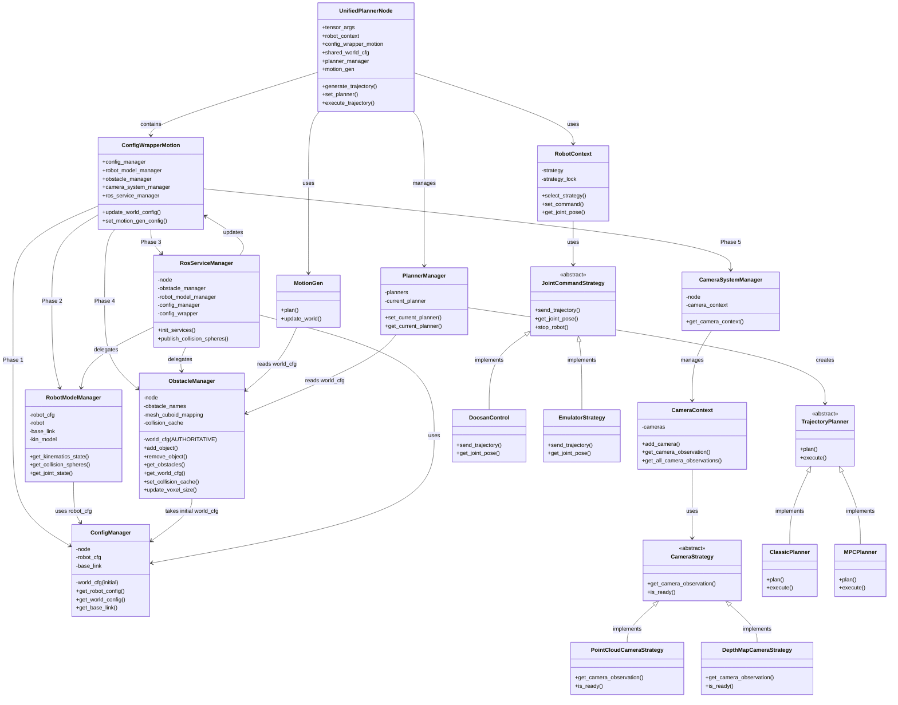

# CuRobo ROS Manager Architecture

**Last Updated:** December 2025
**Introduced:** December 10, 2025 refactoring

## Overview

The curobo_ros system uses a **modular, composition-based architecture** with five specialized manager classes, each handling distinct responsibilities. This design follows the Single Responsibility Principle and enables clean separation of concerns for motion planning, collision management, and ROS integration.

### Architecture Benefits

- **Modularity**: Each manager handles one specific domain
- **Testability**: Managers can be tested independently
- **Maintainability**: Changes to one manager don't affect others
- **Scalability**: New managers can be added without modifying existing code
- **Single Source of Truth**: ObstacleManager is the authoritative source for world configuration

### The Five Core Managers

1. **ConfigManager** - Configuration loading and parameter management
2. **RobotModelManager** - Kinematics and collision sphere computation
3. **ObstacleManager** - Obstacle management and world state (SINGLE SOURCE OF TRUTH)
4. **CameraSystemManager** - Camera configuration and point cloud integration
5. **RosServiceManager** - ROS service interface and publishers

---

## Architecture Diagram



**Initialization Order:**
Phase 1 (ConfigManager) → Phase 2 (RobotModelManager) → Phase 3 (RosServiceManager) → Phase 4 (ObstacleManager) → Phase 5 (CameraSystemManager)

**Strategy Patterns:**
- **Planner Strategy**: Dynamic algorithm selection (Classic, MPC, MultiPoint, JointSpace)
- **Robot Strategy**: Hardware abstraction (Doosan, UR5e, Emulator, Ghost)
- **Camera Strategy**: Sensor abstraction (PointCloud, DepthMap)

---

## The Five Managers

### 1. ConfigManager

**File:** `/home/ros2_ws/src/curobo_ros/curobo_ros/core/config_manager.py`

**Purpose:** Centralized configuration loading and parameter management.

**Responsibilities:**
- Load robot configuration from YAML files
- Load initial world configuration from files or defaults
- Manage ROS parameters (base_link, world_file, etc.)
- Set up CUDA device configuration for tensor operations

**Key Methods:**
| Method | Returns | Description |
|--------|---------|-------------|
| `get_robot_config()` | `RobotConfig` | Returns robot configuration with kinematics |
| `get_world_config()` | `WorldConfig` | Returns **initial** world config (before obstacles) |
| `get_base_link()` | `str` | Returns robot base frame name |

**Important Notes:**
- ConfigManager loads the **initial** world configuration
- After initialization, **ObstacleManager becomes the single source of truth** for world_cfg
- For runtime world configuration with obstacles, use `obstacle_manager.get_world_cfg()`

**Configuration Flow:**
```
ROS Parameters (base_link, world_file)
    ↓
ConfigManager loads YAML files
    ↓
Initial world_cfg passed to ObstacleManager
    ↓
ObstacleManager becomes authoritative source
```

---

### 2. RobotModelManager

**File:** `/home/ros2_ws/src/curobo_ros/curobo_ros/core/robot_model_manager.py`

**Purpose:** Manage GPU-accelerated robot kinematics and collision geometry.

**Responsibilities:**
- Create and manage CudaRobotModel for forward/inverse kinematics
- Compute collision spheres for robot visualization
- Provide current joint state access
- Handle CUDA device/dtype configuration

**Key Methods:**
| Method | Returns | Description |
|--------|---------|-------------|
| `get_kinematics_state(joint_positions)` | `KinematicsState` | Compute FK from joint positions |
| `get_collision_spheres()` | `List[List[float]]` | Get robot collision spheres [x,y,z,radius] |
| `get_joint_state()` | `JointState` | Get current joint state from robot interface |

**Use Cases:**
- Computing forward kinematics for visualization
- Getting collision spheres for RViz visualization
- Accessing current robot state for planning

**Example: Visualize Robot Collision Spheres**

The collision spheres are automatically published to RViz:
```bash
# View collision spheres in RViz
# Add MarkerArray display, topic: /unified_planner/collision_spheres
ros2 topic echo /unified_planner/collision_spheres
```

The RosServiceManager publishes collision spheres at 0.5s intervals using the RobotModelManager.

---

### 3. ObstacleManager ⭐

**File:** `/home/ros2_ws/src/curobo_ros/curobo_ros/core/obstacle_manager.py`

**Purpose:** **SINGLE SOURCE OF TRUTH** for world configuration and obstacle management.

**Responsibilities:**
- Maintain authoritative world_cfg with all obstacles
- Add/remove obstacles with validation
- Convert primitives (cuboids, capsules, cylinders, spheres) to collision geometry
- Handle mesh voxelization using MeshBloxilization pipeline
- Manage collision cache (OBB, mesh, blox)
- Compute voxel grids for collision checking

**Key Methods:**
| Method | Service/Topic | Description |
|--------|---------------|-------------|
| `add_object()` | `/add_object` | Add cuboid, capsule, cylinder, sphere, or mesh |
| `remove_object()` | `/remove_object` | Remove obstacle and cleanup derived cuboids |
| `remove_all_objects()` | `/remove_all_objects` | Clear all obstacles |
| `get_obstacles()` | `/get_obstacles` | List all obstacle names |
| `get_voxel_grid()` | `/get_voxel_grid` | Compute voxel grid (1.52m cube) |
| `set_collision_cache()` | `/set_collision_cache` | Update collision cache parameters |
| `get_world_cfg()` | N/A (internal) | Return authoritative world configuration |
| `update_voxel_size()` | N/A (internal) | Update voxel size for mesh voxelization |

**Critical Concept: Single Source of Truth**

After initialization:
- **ConfigManager.world_cfg** → Initial template (used once)
- **ObstacleManager.world_cfg** → Authoritative runtime state ⭐

All planning, collision checking, and visualization must use `obstacle_manager.get_world_cfg()`.

**Mesh Handling Strategy**

Meshes are stored in **two lists** for seamless collision checker switching:

1. **world_cfg.mesh** - High-fidelity mesh geometry (for MESH collision checker)
2. **world_cfg.cuboid** - Voxelized cuboid approximations (for BLOX collision checker)
   - Created by MeshBloxilization pipeline
   - Named as `{mesh_name}_cuboid_{idx}`
   - Tracked in `mesh_cuboid_mapping` for cleanup

When you add a mesh object:
```bash
# Add mesh (stored in both mesh and cuboid lists)
ros2 service call /unified_planner/add_object curobo_msgs/srv/AddObject \
  "{name: 'part', primitive_type: 4, mesh_file_path: '/path/to/mesh.stl', \
    pose: {position: {x: 0.5, y: 0.0, z: 0.3}, orientation: {w: 1.0}}}"

# Mesh internally stored as:
# - world_cfg.mesh: ["part"] (original mesh)
# - world_cfg.cuboid: ["part_cuboid_0", "part_cuboid_1", ...] (voxelized)
```

When you remove the mesh:
```bash
ros2 service call /unified_planner/remove_object curobo_msgs/srv/RemoveObject \
  "{name: 'part'}"

# Automatically removes:
# - Original mesh from world_cfg.mesh
# - ALL derived cuboids from world_cfg.cuboid
```

**Example: Add Obstacle and Update Planners**
```bash
# 1. Add obstacle
ros2 service call /unified_planner/add_object curobo_msgs/srv/AddObject \
  "{name: 'table', primitive_type: 0, dims: [1.0, 0.8, 0.05], \
    pose: {position: {x: 0.5, y: 0.0, z: 0.0}, orientation: {w: 1.0}}}"

# 2. Verify obstacle added
ros2 service call /unified_planner/get_obstacles std_srvs/srv/Trigger

# 3. All planners automatically see the new obstacle (shared reference)
# No manual update needed - world_cfg is shared across all planners
```

---

### 4. CameraSystemManager

**File:** `/home/ros2_ws/src/curobo_ros/curobo_ros/core/camera_system_manager.py`

**Purpose:** Load and manage camera configurations for point cloud processing.

**Responsibilities:**
- Load camera configuration from YAML files
- Create and configure CameraContext for multiple cameras
- Support different camera types (point cloud, depth, RGB-D)
- Handle camera intrinsics and extrinsics

**Key Methods:**
| Method | Returns | Description |
|--------|---------|-------------|
| `get_camera_context()` | `CameraContext` | Returns camera context with all configured cameras |

**Camera Configuration YAML Structure:**
```yaml
cameras:
  - name: "camera_1"
    type: "point_cloud"  # or "depth", "rgbd"
    topic: "/camera/points"
    frame_id: "camera_link"
    intrinsics:
      fx: 525.0
      fy: 525.0
      cx: 319.5
      cy: 239.5
    extrinsics:
      # Camera pose relative to robot base
      position: {x: 0.5, y: 0.0, z: 0.8}
      orientation: {x: 0.0, y: 0.0, z: 0.0, w: 1.0}
```

**Use Cases:**
- Dynamic obstacle detection from point clouds
- Real-time collision avoidance with camera input
- Multi-camera fusion for comprehensive workspace coverage

---

### 5. RosServiceManager

**File:** `/home/ros2_ws/src/curobo_ros/curobo_ros/core/ros_service_manager.py`

**Purpose:** Bridge between ROS interface and internal manager logic.

**Responsibilities:**
- Create and manage all ROS services for collision/obstacle operations
- Publish visualization markers (collision spheres)
- Delegate service callbacks to appropriate managers
- Update planners when world configuration changes
- Manage periodic timers for publishing

**ROS Services Created:**
| Service | Type | Delegates To |
|---------|------|--------------|
| `/add_object` | `AddObject` | ObstacleManager |
| `/remove_object` | `RemoveObject` | ObstacleManager |
| `/remove_all_objects` | `Trigger` | ObstacleManager |
| `/get_obstacles` | `Trigger` | ObstacleManager |
| `/get_voxel_grid` | `GetVoxelGrid` | ObstacleManager |
| `/get_collision_distance` | `GetCollisionDistance` | ObstacleManager + RobotModelManager |
| `/set_collision_cache` | `SetCollisionCache` | ObstacleManager |
| `/is_available` | `Trigger` | Self |

**ROS Topics Published:**
| Topic | Type | Rate | Description |
|-------|------|------|-------------|
| `/collision_spheres` | `MarkerArray` | 0.5 Hz | Robot collision sphere visualization |

**Service Delegation Pattern:**

When a ROS service is called:
```
ROS Client Request
    ↓
RosServiceManager._callback_*()
    ↓
Appropriate Manager (ObstacleManager, etc.)
    ↓
If world changed: ConfigWrapper.update_world_config()
    ↓
Response returned to client
```

**Example: Trace an Add Object Call**

```bash
ros2 service call /unified_planner/add_object curobo_msgs/srv/AddObject \
  "{name: 'box', primitive_type: 0, dims: [0.2, 0.2, 0.2], \
    pose: {position: {x: 0.5, y: 0.3, z: 0.4}, orientation: {w: 1.0}}}"
```

**Internal Flow:**
1. RosServiceManager receives request
2. Validates request parameters
3. Calls `obstacle_manager.add_object(request, response)`
4. ObstacleManager validates name uniqueness and dimensions
5. ObstacleManager adds cuboid to `world_cfg.cuboid`
6. RosServiceManager calls `config_wrapper.update_world_config()`
7. ConfigWrapper clears collision cache
8. ConfigWrapper calls `motion_gen.update_world(world_cfg)`
9. All planners now see the new obstacle (shared reference)
10. Response returned to client with success status

---

## Initialization Sequence

The managers are initialized in a specific order to satisfy dependencies:

### Phase 1: ConfigManager
```
ConfigManager(node)
├── Load ROS parameters (base_link, world_file)
├── Load robot configuration from YAML
└── Load initial world configuration from file or default
```

**ROS Parameters:**
```bash
# View configuration parameters
ros2 param list /unified_planner | grep -E "(base_link|world_file|robot_file)"
ros2 param get /unified_planner base_link
ros2 param get /unified_planner world_file
```

### Phase 2: RobotModelManager
```
RobotModelManager(robot_cfg, robot, base_link)
└── Create CudaRobotModel for GPU kinematics
```

**Dependencies:** ConfigManager (needs robot_cfg)

### Phase 4: ObstacleManager
```
ObstacleManager(node, config_manager, initial_world_cfg)
├── Initialize world_cfg from ConfigManager
├── Initialize obstacle tracking lists
└── Setup collision cache and checker type (BLOX by default)
```

**Dependencies:** ConfigManager (needs initial world_cfg)

### Phase 5: CameraSystemManager
```
CameraSystemManager(node, cameras_config_file)
└── Load YAML and create CameraContext
```

**Dependencies:** None (standalone)

### Phase 3: RosServiceManager
```
RosServiceManager(node, obstacle_mgr, robot_mgr, config_mgr, config_wrapper)
├── Create all ROS services
├── Create collision spheres publisher
└── Create periodic timer (0.5s interval)
```

**Dependencies:** All other managers (needs references to delegate to)

### Complete Initialization Timeline

```
1. UnifiedPlannerNode created
2. ConfigWrapperMotion created
   └── ConfigManager initialized (Phase 1)
       └── RobotModelManager initialized (Phase 2)
           └── ObstacleManager initialized (Phase 4)
               └── CameraSystemManager initialized (Phase 5)
3. RosServiceManager initialized (Phase 3)
4. PlannerManager created
5. MotionGen created and warmed up
6. Node ready - services available
```

**Verify Initialization:**
```bash
# Check if node is ready
ros2 service call /unified_planner/is_available std_srvs/srv/Trigger

# Expected response:
# success: true
# message: 'Node is available and ready'
```

---

## Design Patterns

### 1. Composition Over Inheritance

Instead of a monolithic class with all functionality, ConfigWrapperMotion uses **composition** to delegate to specialized managers:

```
ConfigWrapperMotion (Orchestrator)
├── config_manager (Configuration)
├── robot_model_manager (Kinematics)
├── obstacle_manager (World State)
├── camera_system_manager (Sensors)
└── ros_service_manager (ROS Interface)
```

**Benefits:**
- Each manager can be tested independently
- Changes to one manager don't affect others
- New managers can be added without modifying existing code

### 2. Single Source of Truth

**ObstacleManager.world_cfg** is the **authoritative** world configuration after initialization.

```
ConfigManager.world_cfg (initial template)
    ↓ (passed once during initialization)
ObstacleManager.world_cfg (SINGLE SOURCE OF TRUTH)
    ↑ (all access goes through this)
All Planners (MotionGen, MPC, etc.)
```

**Anti-Pattern to Avoid:**
```python
# ❌ WRONG - Uses stale initial config
world = config_manager.get_world_config()

# ✅ CORRECT - Uses authoritative runtime config
world = obstacle_manager.get_world_cfg()
```

### 3. Lazy Loading

Expensive components are created **on-first-use** to reduce startup time:

- **MotionGen**: Created during initialization (required for most operations)
- **MPC Solver**: Created on-first-use when MPC planner is requested
- **Planners**: Cached in PlannerManager, retrieved instantly on subsequent use

**Example:**
```bash
# First call to MPC planner: ~2-3 seconds (creates MPC solver)
ros2 service call /unified_planner/set_planner curobo_msgs/srv/SetPlanner "{planner_type: 1}"

# Subsequent calls to MPC planner: <10ms (retrieves cached planner)
ros2 service call /unified_planner/set_planner curobo_msgs/srv/SetPlanner "{planner_type: 1}"
```

### 4. Reference Sharing

All planners share the **same reference** to `obstacle_manager.world_cfg`:

```python
# In UnifiedPlannerNode initialization:
shared_world_cfg = obstacle_manager.world_cfg  # Not a copy!

# In MotionGen:
motion_gen.update_world(shared_world_cfg)

# In MPC:
mpc_solver.world = shared_world_cfg
```

**Benefit:** When obstacles change, all planners automatically see updates without manual propagation.

### 5. Service Delegation Pattern

RosServiceManager acts as a **facade** that delegates to appropriate managers:

```
ROS Service Request
    ↓
RosServiceManager._callback_*()
    ↓
    ├─ ObstacleManager (add/remove objects)
    ├─ RobotModelManager (get collision spheres)
    ├─ ConfigManager (get parameters)
    └─ ConfigWrapper (update planners)
    ↓
Response + Side Effects
```

**Example Implementation:**
```python
def _callback_add_object(self, request, response):
    # 1. Delegate to ObstacleManager
    self.obstacle_manager.add_object(self.node, request, response)

    # 2. Update all planners if successful
    if response.success:
        self.config_wrapper.update_world_config()

    return response
```

### 6. Strategy Pattern (Planners, Robots, Cameras)

The system uses the **Strategy Pattern** in three key areas to enable runtime flexibility and extensibility.

#### 6.1 Planner Strategy

**Purpose**: Switch between different planning algorithms at runtime without modifying code.

**Strategy Interface**: `TrajectoryPlanner` (abstract base class)
- `plan()` - Generate trajectory
- `execute()` - Execute trajectory
- `get_planner_name()` - Return planner identifier

**Concrete Implementations**:
```
TrajectoryPlanner (Abstract)
├── ClassicPlanner - MotionGen-based (open-loop)
├── MPCPlanner - Model Predictive Control (closed-loop)
├── MultiPointPlanner - Multiple waypoint planning
└── JointSpacePlanner - Joint-space interpolation
```

**Factory & Manager**: `PlannerFactory` creates planners, `PlannerManager` caches and manages them.

**Dynamic Switching**:
```bash
# Switch to classic planner (0)
ros2 service call /unified_planner/set_planner curobo_msgs/srv/SetPlanner "{planner_type: 0}"

# Switch to MPC planner (1)
ros2 service call /unified_planner/set_planner curobo_msgs/srv/SetPlanner "{planner_type: 1}"
```

**Use Cases**:
- Static environments → Use ClassicPlanner (faster)
- Dynamic obstacles → Use MPCPlanner (reactive)
- Multiple waypoints → Use MultiPointPlanner

#### 6.2 Robot Strategy

**Purpose**: Abstract hardware-specific robot control implementations for different robot models.

**Strategy Interface**: `JointCommandStrategy` (abstract base class)
- `send_trajectory()` - Send trajectory to robot controller
- `get_joint_pose()` - Get current joint positions
- `stop_robot()` - Emergency stop
- `get_progression()` - Get execution progress (0.0 to 1.0)

**Concrete Implementations**:
```
JointCommandStrategy (Abstract)
├── DoosanControl - Doosan M1013 robot control
├── EmulatorStrategy - Software emulator for testing
├── GhostStrategy - RViz visualization (always active)
└── UR5eControl - Universal Robots UR5e (placeholder)
```

**Context Manager**: `RobotContext` manages strategy selection and provides thread-safe switching.

**Dynamic Switching**:
```bash
# Switch robot strategy via ROS parameter
ros2 param set /unified_planner robot_type "emulator"

# Or via service (if implemented)
ros2 service call /unified_planner/set_robot_strategy ...
```

**Configuration-Driven Selection**:
```yaml
# In launch file or config
robot_type: "doosan_m1013"  # Automatically selects DoosanControl strategy
```

**Use Cases**:
- Real hardware → Use DoosanControl or UR5eControl
- Testing without hardware → Use EmulatorStrategy
- Visualization → GhostStrategy (always runs alongside real strategy)

**Benefits**:
- **Hardware Independence**: Same planning code works with different robots
- **Testing**: Use emulator for development, switch to real hardware for deployment
- **Safety**: Test with emulator before risking real hardware
- **Visualization**: Ghost strategy provides real-time RViz feedback

#### 6.3 Camera Strategy

**Purpose**: Support different sensor types for dynamic obstacle detection.

**Strategy Interface**: `CameraStrategy` (abstract base class)
- `get_camera_observation()` - Return CameraObservation for collision checking
- `is_ready()` - Check if camera data is available
- `set_update_callback()` - Register callback for new data

**Concrete Implementations**:
```
CameraStrategy (Abstract)
├── PointCloudCameraStrategy - 3D point cloud sensors (RealSense, Kinect)
└── DepthMapCameraStrategy - Depth cameras with intrinsics
```

**Context Manager**: `CameraContext` manages multiple cameras and aggregates observations.

**Configuration-Driven Setup**:
```yaml
# In camera config YAML
cameras:
  - name: "overhead_camera"
    type: "point_cloud"
    topic: "/camera/points"
    frame_id: "camera_link"

  - name: "side_camera"
    type: "depth_camera"
    topic: "/camera/depth/image_raw"
    camera_info_topic: "/camera/depth/camera_info"
```

**Multi-Camera Support**:
- Add multiple cameras via configuration
- CameraContext aggregates observations from all ready cameras
- Each camera runs independently with its own strategy
- Failed cameras don't block other cameras

**Use Cases**:
- Point cloud sensors → Use PointCloudCameraStrategy
- Depth cameras → Use DepthMapCameraStrategy
- Multiple viewpoints → Configure multiple cameras in CameraContext

**Benefits**:
- **Sensor Flexibility**: Support different camera types without code changes
- **Multi-Camera Fusion**: Combine observations from multiple sensors
- **Extensibility**: Add new camera types by implementing CameraStrategy interface
- **Runtime Management**: Dynamically add/remove cameras

---

## Key Data Flows

### Flow 1: Adding an Obstacle

```
ros2 service call /unified_planner/add_object
    ↓
RosServiceManager._callback_add_object()
    ↓
ObstacleManager.add_object()
    ├─ Validate name uniqueness
    ├─ Validate dimensions
    ├─ Convert primitive to collision geometry
    └─ Add to world_cfg (cuboid/mesh/capsule/cylinder/sphere)
    ↓
ConfigWrapper.update_world_config()
    ├─ Clear collision cache
    └─ MotionGen.update_world(world_cfg)
    ↓
Response: success=true
```

**CLI Example:**
```bash
# Add table
ros2 service call /unified_planner/add_object curobo_msgs/srv/AddObject \
  "{name: 'table', primitive_type: 0, dims: [1.2, 0.8, 0.05], \
    pose: {position: {x: 0.6, y: 0.0, z: 0.0}, orientation: {w: 1.0}}}"

# Plan trajectory (automatically avoids table)
ros2 service call /unified_planner/generate_trajectory curobo_msgs/srv/GenerateTrajectory \
  "{goal_pose: {position: {x: 0.5, y: 0.3, z: 0.4}, orientation: {w: 1.0}}}"
```

### Flow 2: Planning a Trajectory

```
ros2 service call /unified_planner/generate_trajectory
    ↓
UnifiedPlannerNode.generate_trajectory_callback()
    ↓
PlannerManager.get_current_planner()
    ↓
Planner.plan(start_state, request, config, robot_context)
    ├─ Read obstacle_manager.world_cfg (shared reference)
    ├─ Perform collision checking
    └─ Generate trajectory waypoints
    ↓
Response: trajectory waypoints + success status
```

**CLI Example:**
```bash
# Plan trajectory to goal pose
ros2 service call /unified_planner/generate_trajectory curobo_msgs/srv/GenerateTrajectory \
  "{goal_pose: {position: {x: 0.5, y: 0.3, z: 0.4}, orientation: {w: 1.0}}}"
```

### Flow 3: Collision Sphere Visualization

```
Timer (0.5s interval)
    ↓
RosServiceManager.publish_collision_spheres()
    ↓
RobotModelManager.get_collision_spheres()
    ├─ RobotModelManager.get_joint_state() (current robot state)
    └─ CudaRobotModel.get_state(joint_positions)
    ↓
Create MarkerArray with sphere markers
    ↓
Publish to /unified_planner/collision_spheres
```

**CLI Example:**
```bash
# View collision spheres
ros2 topic echo /unified_planner/collision_spheres

# Each sphere has [x, y, z, radius] in base frame
```

### Flow 4: Updating Collision Cache

```
ros2 service call /unified_planner/set_collision_cache
    ↓
RosServiceManager._callback_set_collision_cache()
    ↓
ObstacleManager.set_collision_cache()
    ├─ Validate cache parameters (obb, mesh, blox)
    └─ Update collision_cache attribute
    ↓
ConfigWrapper.update_world_config() (if needed)
    ↓
ros2 service call /unified_planner/update_motion_gen_config
    ↓
Response: success=true
```

**CLI Example:**
```bash
# Increase OBB cache for more cuboids
ros2 service call /unified_planner/set_collision_cache \
  curobo_msgs/srv/SetCollisionCache "{obb: 200, mesh: -1, blox: -1}"

# Apply changes
ros2 service call /unified_planner/update_motion_gen_config std_srvs/srv/Trigger
```

---

## Manager Interactions Summary

### Dependency Graph

```
ConfigManager (Phase 1)
    ├── RobotModelManager (Phase 2) - uses robot_cfg
    ├── ObstacleManager (Phase 4) - takes initial world_cfg
    └── CameraSystemManager (Phase 5) - independent

RosServiceManager (Phase 3)
    ├── Delegates to ObstacleManager
    ├── Delegates to RobotModelManager
    ├── Uses ConfigManager
    └── Updates ConfigWrapper
```

### Communication Patterns

| From | To | Via | Purpose |
|------|----|----|---------|
| RosServiceManager | ObstacleManager | Method call | Add/remove obstacles |
| RosServiceManager | RobotModelManager | Method call | Get collision spheres |
| RosServiceManager | ConfigWrapper | Method call | Update planners after world change |
| ObstacleManager | ConfigManager | Constructor | Get initial world_cfg |
| RobotModelManager | ConfigManager | Constructor | Get robot_cfg |
| MotionGen | ObstacleManager | Shared reference | Read world_cfg for collision checking |
| MPC | ObstacleManager | Shared reference | Read world_cfg for collision checking |

---

## Backward Compatibility

ConfigWrapperMotion provides **property-based access** for backward compatibility with code expecting direct attribute access:

```python
# Backward-compatible properties
@property
def world_cfg(self):
    return self.obstacle_manager.get_world_cfg()  # SSOT

@property
def robot_cfg(self):
    return self.config_manager.robot_cfg

@property
def base_link(self):
    return self.config_manager.base_link

@property
def collision_checker_type(self):
    return self.obstacle_manager.collision_checker_type

@property
def camera_context(self):
    return self.camera_system_manager.camera_context
```

**Usage:**
```python
# Old code still works
world = config_wrapper.world_cfg  # Internally calls obstacle_manager.get_world_cfg()

# New code can be explicit
world = config_wrapper.obstacle_manager.get_world_cfg()
```

---

## Best Practices

### ✅ DO: Access World Config via ObstacleManager

```python
# Correct: Get authoritative world configuration
world = obstacle_manager.get_world_cfg()
```

### ❌ DON'T: Access World Config via ConfigManager (after initialization)

```python
# Wrong: This is the initial template, not runtime state
world = config_manager.get_world_config()
```

### ✅ DO: Update Planners After Obstacle Changes

```bash
# Add obstacle
ros2 service call /unified_planner/add_object curobo_msgs/srv/AddObject "{...}"

# ObstacleManager and RosServiceManager automatically call update_world_config()
# No manual update needed
```

### ✅ DO: Call update_motion_gen_config After Parameter Changes

```bash
# Modify collision cache
ros2 service call /unified_planner/set_collision_cache \
  curobo_msgs/srv/SetCollisionCache "{obb: 200, mesh: -1, blox: -1}"

# REQUIRED: Apply changes
ros2 service call /unified_planner/update_motion_gen_config std_srvs/srv/Trigger
```

### ✅ DO: Let Managers Handle Their Domain

```
ConfigManager → Configuration loading
RobotModelManager → Kinematics
ObstacleManager → World state (SSOT)
CameraSystemManager → Sensor configuration
RosServiceManager → ROS interface
```

Don't bypass managers by directly modifying internal state.

---

## Troubleshooting

### Issue 1: Collision Cache Errors

**Symptoms:** `Collision cache exceeded` error when adding obstacles

**Possible Causes:**
- Too many obstacles for default cache size
- Mesh voxelization created too many cuboids

**Solution:**
```bash
# Increase collision cache
ros2 service call /unified_planner/set_collision_cache \
  curobo_msgs/srv/SetCollisionCache "{obb: 300, mesh: -1, blox: -1}"

# Apply changes
ros2 service call /unified_planner/update_motion_gen_config std_srvs/srv/Trigger
```

### Issue 2: Manager Initialization Order Error

**Symptoms:** `AttributeError: Manager not initialized` during startup

**Possible Causes:**
- Managers accessed before initialization complete
- Incorrect initialization order

**Solution:**
- Check logs for initialization sequence
- Verify all managers follow Phase 1→2→4→5→3 order
- Ensure dependencies are satisfied (ConfigManager first)

---

## Related Documentation

- [ROS Interfaces Reference](ros-interfaces.md) - Complete service API
- [Tutorial 1: Your First Trajectory](../tutorials/01-first-trajectory.md) - Basic usage
- [Tutorial 3: Collision Objects](../tutorials/03-collision-objects.md) - Obstacle management
- [Parameters Documentation](parameters.md) - Configuration parameters
- [curobo_msgs Package](https://github.com/Lab-CORO/curobo_msgs) - Message definitions

---

[← Back to Concepts](README.md)
