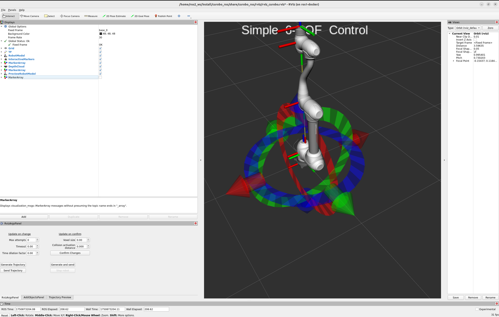
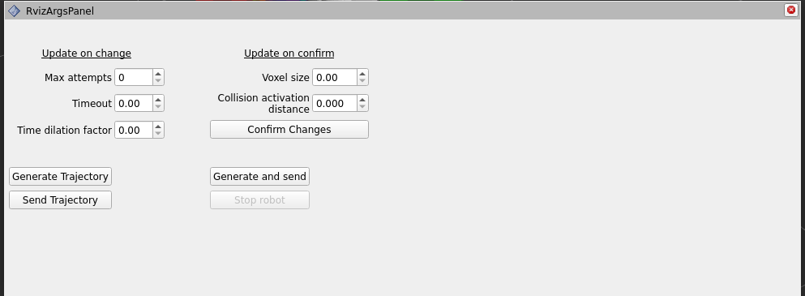
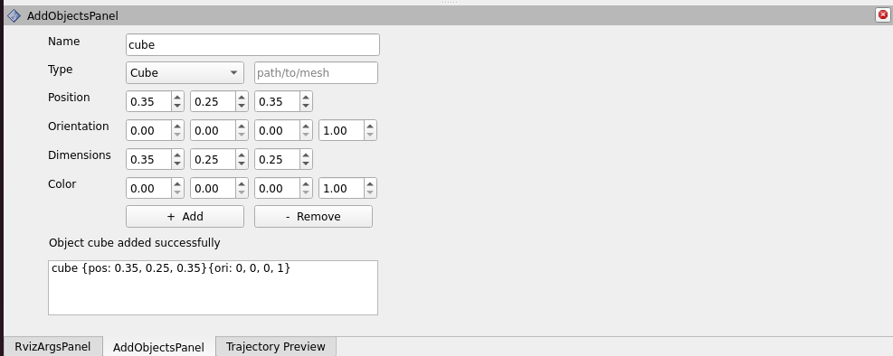

# RViz Plugin for CuRobo ROS

## Overview

The RViz interface is provided by the [curobo_rviz](https://github.com/Lab-CORO/curobo_rviz) package. It provides a graphical interface for:
- **Interactive trajectory planning** using 6-DOF interactive markers
- **Real-time trajectory visualization** with ghost robot preview
- **Object management** for adding collision obstacles
- **Parameter tuning** without command-line tools
- **Debugging and testing** robot motions

**Status**: The plugin currently serves as a debugging and development tool. While functional, some features are still under development toward becoming more user-friendly.

---

## Installation

The RViz plugin is included when you install curobo_ros:

```bash
# If not already installed
cd ~/ros2_ws
colcon build --packages-select curobo_rviz curobo_ros
source install/setup.bash
```

**Dependencies**: Requires RViz2, curobo_ros, and curobo_msgs packages.

---

## Launching the Interface

### Basic Launch

The RViz interface is launched via the `gen_traj.launch.py` launch file:

```bash
ros2 launch curobo_ros gen_traj.launch.py
```

### Launch with Specific Robot

```bash
ros2 launch curobo_ros gen_traj.launch.py robot_config_file:=path/to/robot.yml
```

### Expected Startup Behavior

**Initial Freeze**: The interface will appear to freeze or be unresponsive for 5-30 seconds during startup. This is **expected behavior** while cuRobo:
1. Loads robot configuration
2. Initializes GPU kernels
3. Warms up motion planning algorithms
4. Creates collision checkers

**Ready Indication**: Once warmup completes, the interface becomes responsive and the robot model appears in RViz.

### Initial Interface


> **Tip**: The default layout may appear cluttered. Rearrange panels for better usability (see recommended layout below).

### Recommended Layout



**Recommended Panel Arrangement:**
- **Left**: Control Panel + Object Manager
- **Center**: 3D Visualization (largest area)
- **Bottom**: Trajectory Visualization Timeline

---

## Interface Components

### 1. 🧭 Control Panel

The **Control Panel** is the main interface for planning and executing robot motions.



#### Features

**Interactive Marker Control:**
- **6-DOF Marker**: Position and orient the target pose in 3D space
- **Real-time Updates**: Marker position updates as you drag
- **Snap to Grid** (optional): Enable for precise positioning

**Planning Controls:**
- **Generate Trajectory** button: Plan path from current pose to marker pose
- **Execute Trajectory** button: Send planned trajectory to robot
- **Cancel Execution** button: Stop robot mid-motion (if supported)
- **Clear Trajectory** button: Remove current trajectory from visualization

**Parameter Sliders:**
- **Time Dilation Factor** (0.3-1.0): Adjust robot speed
- **Collision Activation Distance** (0.01-0.1 m): Safety margin
- **Max Attempts** (1-10): Planning retries on failure
- **Timeout** (0.5-30.0 s): Maximum planning time

#### Using the Interactive Marker

**Moving the Marker:**
1. **Translation**: Click and drag the arrow handles (X: red, Y: green, Z: blue)
2. **Rotation**: Click and drag the ring handles around each axis
3. **Combined Motion**: Hold Shift while dragging for simultaneous translation + rotation

**Tips:**
- Use the mouse scroll wheel to zoom in/out for precision
- Right-click and drag to rotate the camera view
- Middle-click and drag to pan the camera

**Example Workflow:**
```
1. Move interactive marker to desired goal pose
2. Click "Generate Trajectory" button
3. Wait for trajectory visualization to appear
4. Inspect trajectory in timeline (see Trajectory Visualization section)
5. Click "Execute Trajectory" to send to robot
6. Monitor execution in real-time
```

#### Parameter Tuning from Panel

**Time Dilation Factor:**
- Slider range: 0.3 (slow) to 1.0 (fast)
- Changes take effect on next trajectory generation
- Use lower values (0.3-0.5) for testing
- Use higher values (0.7-1.0) for production

**Collision Activation Distance:**
- Slider range: 0.01 m (tight) to 0.1 m (conservative)
- Changes require regenerating trajectory
- Smaller values allow tighter paths
- Larger values increase safety margin

**Max Attempts:**
- Slider range: 1 (single try) to 10 (persistent)
- Affects planning success rate vs. latency
- Increase for difficult planning problems
- Keep at 1 for real-time responsiveness

---

### 2. 📈 Trajectory Visualization

This panel provides a timeline-based visualization of the generated trajectory.


#### Features

**Timeline Display:**
- **Horizontal axis**: Time (seconds)
- **Playback controls**: Play, pause, stop, scrub timeline
- **Speed control**: Adjust playback speed (0.1x to 5.0x)
- **Loop option**: Repeat trajectory animation

**Ghost Robot:**
- **Translucent robot model**: Shows predicted motion
- **Color-coded velocity**: Red (fast) → Yellow (medium) → Green (slow)
- **Joint configuration**: Visualize joint angles throughout trajectory
- **Collision spheres**: Optional display of robot collision geometry

**Joint Plots:**
- **Position traces**: One line per joint
- **Velocity traces**: Joint velocities over time
- **Acceleration traces**: Joint accelerations (if enabled)
- **Limits display**: Show joint position/velocity limits as red lines

#### Using Trajectory Visualization

**Inspecting Trajectories:**
```
1. After generating trajectory, timeline appears with waypoints
2. Click "Play" to animate ghost robot along path
3. Drag timeline scrubber to inspect specific points
4. Check velocity plot for smoothness (should be continuous)
5. Verify robot doesn't collide with obstacles
6. Check joint plots for constraint violations
```

**Common Inspection Points:**
- **Start/end poses**: Verify correct initial and final configurations
- **Mid-trajectory**: Check for unexpected joint flips or singularities
- **Near obstacles**: Ensure sufficient clearance
- **Velocity peaks**: Identify fast/aggressive motion segments
- **Acceleration spikes**: May indicate non-smooth trajectory

**Playback Controls:**
- **Play/Pause**: Spacebar or play button
- **Scrub**: Click and drag timeline scrubber
- **Speed**: Use +/- buttons or slider (0.1x to 5.0x)
- **Loop**: Enable to continuously replay trajectory
- **Frame-by-frame**: Use arrow keys for precise inspection

---

### 3. 📦 Object Manager

The **Object Manager** allows you to add and remove collision obstacles in the robot's environment.



#### Supported Object Types

| Type | Primitive ID | Parameters | Use Case |
|------|-------------|------------|----------|
| **Cuboid** | 0 | Dimensions [length, width, height] | Tables, walls, boxes |
| **Sphere** | 1 | Radius | Balls, rounded obstacles |
| **Cylinder** | 2 | Radius, height | Columns, pipes, cans |
| **Capsule** | 3 | Radius, height | Rounded cylinders |
| **Mesh** | 4 | Mesh file path (.stl, .obj) | Complex geometries |

#### Adding Objects via Object Manager

**Step-by-Step:**
1. Select object type from dropdown (Cuboid, Sphere, Cylinder, Capsule, Mesh)
2. Enter object name (must be unique)
3. Set dimensions (depends on object type):
   - **Cuboid**: Length, Width, Height (meters)
   - **Sphere**: Radius (meters)
   - **Cylinder**: Radius, Height (meters)
   - **Capsule**: Radius, Height (meters)
   - **Mesh**: Browse for file path
4. Set pose (position + orientation):
   - **Position**: X, Y, Z (meters, relative to robot base)
   - **Orientation**: Quaternion (x, y, z, w) or Euler angles
5. Click "Add Object" button

**Example Values:**
```
Table:
  Type: Cuboid
  Name: "table"
  Dimensions: [1.2, 0.8, 0.05]
  Position: [0.6, 0.0, 0.0]
  Orientation: [0, 0, 0, 1]

Wall:
  Type: Cuboid
  Name: "wall"
  Dimensions: [0.1, 2.0, 2.0]
  Position: [-0.5, 0.0, 1.0]
  Orientation: [0, 0, 0, 1]

Cylinder:
  Type: Cylinder
  Name: "pole"
  Radius: 0.05
  Height: 1.5
  Position: [0.5, 0.5, 0.75]
  Orientation: [0, 0, 0, 1]
```

#### Removing Objects

**Single Object:**
1. Select object from list in Object Manager
2. Click "Remove Object" button
3. Object is removed from collision checking

**All Objects:**
1. Click "Remove All Objects" button
2. Clears entire obstacle list

**Via Command Line (Alternative):**
```bash
# Remove specific object
ros2 service call /unified_planner/remove_object curobo_msgs/srv/RemoveObject \
  "{name: 'table'}"

# Remove all objects
ros2 service call /unified_planner/remove_all_objects std_srvs/srv/Trigger
```

#### Mesh Object Handling

**Important**: Mesh objects are voxelized into cuboids for collision checking (see [Parameters Guide - Collision Cache](parameters.md#collision-cache-parameters)).

**Before adding meshes:**
```bash
# Increase OBB cache for mesh cuboids
ros2 service call /unified_planner/set_collision_cache \
  curobo_msgs/srv/SetCollisionCache "{obb: 300, mesh: -1, blox: -1}"

ros2 service call /unified_planner/update_motion_gen_config std_srvs/srv/Trigger
```

**Adding mesh via Object Manager:**
1. Select "Mesh" from type dropdown
2. Enter mesh name
3. Browse and select mesh file (.stl or .obj format)
4. Set pose (position + orientation)
5. Click "Add Object"
6. Mesh is automatically voxelized into cuboids

**Visualization Limitation:**
- Objects added via Object Manager are not currently visualized in RViz 3D view
- This feature is under development
- Objects DO affect collision checking and trajectory planning
- Verify objects added by checking obstacle list or testing trajectory planning

---

### 4. 🎨 RViz 3D Visualization

The main 3D viewport displays:

**Robot Model:**
- **Actual robot**: Current robot state (from /joint_states topic)
- **Ghost robot**: Predicted trajectory visualization (translucent)
- **Collision spheres**: Optional display of robot collision geometry

**Interactive Marker:**
- **6-DOF marker**: Target pose for trajectory planning
- **Color-coded handles**: X (red), Y (green), Z (blue)
- **Rotation rings**: Orientation control

**Coordinate Frames:**
- **Base frame**: Robot base coordinate frame
- **End-effector frame**: Tool center point (TCP)
- **World frame**: Global reference frame

**Visualization Options:**
- **Grid**: Enable/disable ground plane grid
- **Axes**: Show/hide coordinate frame axes
- **Collision Spheres**: Toggle robot collision geometry
- **Background**: Change background color (light/dark)

#### Camera Controls

**Mouse Navigation:**
- **Rotate**: Left-click and drag
- **Pan**: Middle-click and drag (or Shift + left-click)
- **Zoom**: Scroll wheel (or Right-click and drag up/down)

**View Presets:**
- **Top View**: Look down on robot from above
- **Front View**: Look at robot from front
- **Side View**: Look at robot from side
- **Isometric**: 45° angled view (recommended)

**Tips:**
- Press 'F' to focus camera on robot
- Press 'R' to reset view to default
- Use orthographic projection for precise measurements

---

## Common Workflows

### Workflow 1: Plan and Execute Simple Motion

```
1. Launch RViz plugin:
   ros2 launch curobo_ros gen_traj.launch.py

2. Wait for warmup to complete (~10-20 seconds)

3. Move interactive marker to desired goal pose:
   - Drag translation arrows to move
   - Drag rotation rings to orient

4. Click "Generate Trajectory" button

5. Wait for trajectory to appear in timeline (~1-3 seconds)

6. Inspect trajectory:
   - Play animation to verify motion
   - Check velocity plot for smoothness
   - Ensure no collision with obstacles

7. Click "Execute Trajectory" button to send to robot

8. Monitor execution in real-time
```

### Workflow 2: Plan with Obstacles

```
1. Launch RViz plugin

2. Add obstacles via Object Manager:
   - Select "Cuboid" type
   - Name: "table"
   - Dimensions: [1.2, 0.8, 0.05]
   - Position: [0.6, 0.0, 0.0]
   - Click "Add Object"

3. Move interactive marker to goal (potentially behind obstacle)

4. Click "Generate Trajectory"

5. Trajectory automatically avoids obstacle

6. Inspect clearance in trajectory animation

7. Execute if clearance is acceptable
```

### Workflow 3: Tuning Parameters for Better Performance

```
1. Generate initial trajectory (baseline)

2. If too slow:
   - Increase Time Dilation Factor slider (0.7-1.0)
   - Regenerate trajectory
   - Compare execution time

3. If planning fails:
   - Increase Max Attempts slider (3-5)
   - Increase Timeout slider (10-15 seconds)
   - Regenerate trajectory

4. If colliding with obstacles:
   - Increase Collision Activation Distance (0.03-0.05 m)
   - Regenerate trajectory

5. If path too conservative:
   - Decrease Collision Activation Distance (0.01-0.02 m)
   - Regenerate trajectory
```

---

## Troubleshooting

### Issue 1: RViz Freezes at Startup

**Symptoms:** RViz window opens but is unresponsive, robot model doesn't appear

**Causes:**
- cuRobo warmup phase (normal, wait 10-30 seconds)
- GPU initialization taking longer than expected
- Out of GPU memory

**Solutions:**
```bash
# Check if node is running
ros2 node list | grep unified_planner

# Check for errors in terminal
# Look for CUDA errors or GPU memory issues

# If out of GPU memory, try reducing voxel_size
ros2 launch curobo_ros gen_traj.launch.py voxel_size:=0.08
```

### Issue 2: Interactive Marker Not Responding

**Symptoms:** Cannot move interactive marker, handles don't appear

**Causes:**
- Interactive marker not published yet (warmup incomplete)
- RViz interactive marker plugin disabled
- Marker hidden or out of view

**Solutions:**
```bash
# Check if marker is published
ros2 topic list | grep interactive_marker

# Verify marker topic exists
ros2 topic echo /unified_planner/interactive_marker/update --once

# In RViz: Displays -> Interactive Markers -> Update Topic
# Ensure topic is set to /unified_planner/interactive_marker/update
```

### Issue 3: Trajectory Generation Fails

**Symptoms:** Click "Generate Trajectory" but nothing happens, error message appears

**Causes:**
- Goal pose unreachable (outside workspace or violates joint limits)
- Collision with obstacles blocking path
- Timeout exceeded

**Solutions:**
```bash
# Test if goal is reachable using IK
ros2 service call /unified_planner/ik_batch_poses curobo_msgs/srv/Ik \
  "{pose: {position: {x: 0.5, y: 0.3, z: 0.4}, orientation: {w: 1.0}}}"

# If IK fails, adjust marker pose closer to robot

# Increase timeout in Control Panel (slider)

# Increase Max Attempts in Control Panel (slider)

# Check terminal for detailed error messages
```

### Issue 4: Added Objects Not Affecting Planning

**Symptoms:** Added objects via Object Manager but trajectory goes through them

**Causes:**
- Object visualization not updated (this is known limitation)
- Object cache exceeded
- Object pose incorrect

**Solutions:**
```bash
# Verify object was added
ros2 service call /unified_planner/get_obstacles std_srvs/srv/Trigger

# Check collision cache
ros2 param get /unified_planner collision_cache

# Increase cache if needed
ros2 service call /unified_planner/set_collision_cache \
  curobo_msgs/srv/SetCollisionCache "{obb: 300, mesh: -1, blox: -1}"

ros2 service call /unified_planner/update_motion_gen_config std_srvs/srv/Trigger

# Regenerate trajectory
```

### Issue 5: Trajectory Visualization Not Appearing

**Symptoms:** Trajectory generates successfully but timeline/ghost robot doesn't appear

**Causes:**
- Trajectory preview panel not enabled
- Topic connection issue
- RViz panel configuration incorrect

**Solutions:**
```bash
# Check if trajectory topic is published
ros2 topic list | grep trajectory

ros2 topic echo /unified_planner/trajectory --once

# In RViz: Panels -> Add New Panel -> Trajectory Preview
# Ensure topic is set to /unified_planner/trajectory
```

---

## Tips and Best Practices

### Planning Tips

1. **Start with Simple Motions**: Test with nearby goals before attempting complex motions
2. **Check Reachability First**: Use IK service to verify goal is reachable before planning
3. **Inspect Before Executing**: Always review trajectory animation before executing on real robot
4. **Use Conservative Parameters**: Start with slow speeds (time_dilation_factor=0.3) for testing
5. **Add Obstacles Gradually**: Add one obstacle at a time to ensure collision avoidance works

### Visualization Tips

1. **Adjust Camera Angle**: Use isometric view (45° angle) for best spatial awareness
2. **Enable Grid**: Helps visualize robot position relative to ground plane
3. **Use Loop Playback**: Enable loop to continuously review trajectory
4. **Slow Playback**: Use 0.5x or 0.25x speed for detailed inspection
5. **Check Multiple Views**: Inspect trajectory from multiple camera angles

### Object Management Tips

1. **Increase Cache First**: Before adding meshes, increase OBB cache (see [Collision Cache](parameters.md#collision-cache-parameters))
2. **Use Simple Shapes**: Prefer cuboids/cylinders over meshes when possible (faster)
3. **Descriptive Names**: Use clear names for objects (e.g., "table_left", "wall_back")
4. **Remove Unused Objects**: Clear obstacles when not needed to free GPU memory
5. **Verify Addition**: Always check obstacle list after adding objects

### Performance Tips

1. **Close Unused Panels**: Hide panels you're not using to improve responsiveness
2. **Reduce Display Rate**: Lower RViz update rate if visualization is laggy (Edit → Preferences)
3. **Disable Unnecessary Displays**: Turn off collision spheres, axes, or other displays when not needed
4. **Use Larger Voxels**: Increase voxel_size (0.08-0.1 m) for faster planning with simple obstacles

---

## Keyboard Shortcuts

| Shortcut | Action |
|----------|--------|
| **Spacebar** | Play/pause trajectory animation |
| **Left/Right Arrow** | Step forward/backward in trajectory timeline |
| **+/-** | Increase/decrease playback speed |
| **R** | Reset camera view |
| **F** | Focus camera on robot |
| **G** | Toggle grid display |
| **Esc** | Deselect interactive marker |

---

## Related Documentation

- [Tutorial 1: Your First Trajectory](../tutorials/01-first-trajectory.md) - Basic planning workflow
- [Tutorial 3: Collision Objects](../tutorials/03-collision-objects.md) - Object management details
- [Parameters Guide](parameters.md) - Parameter tuning reference
- [ROS Interfaces](ros-interfaces.md) - Service API reference
- [curobo_rviz GitHub](https://github.com/Lab-CORO/curobo_rviz) - Plugin source code

---

## Known Limitations

- **Object Visualization**: Objects added via Object Manager are not visualized in RViz (under development)
- **Mesh Preview**: Mesh objects show as cuboids in collision checking, not original mesh
- **Real-time Modification**: Cannot modify objects after adding (must remove and re-add)
- **Undo/Redo**: No undo functionality for object addition or trajectory generation
- **Configuration Persistence**: RViz layout and parameter values don't persist across sessions

These limitations are actively being addressed in future releases.