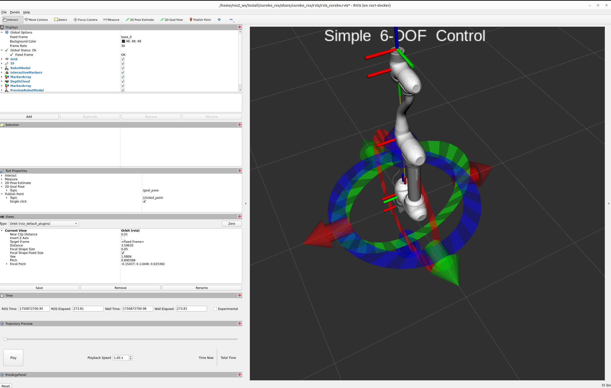
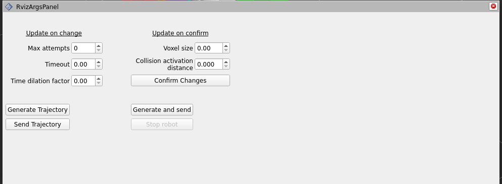
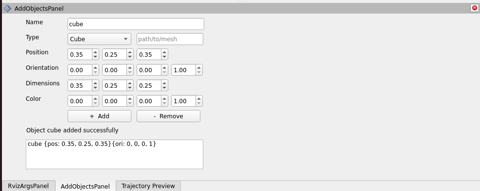
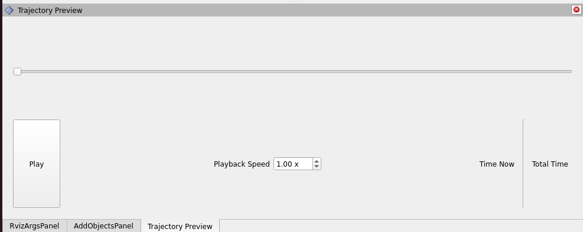
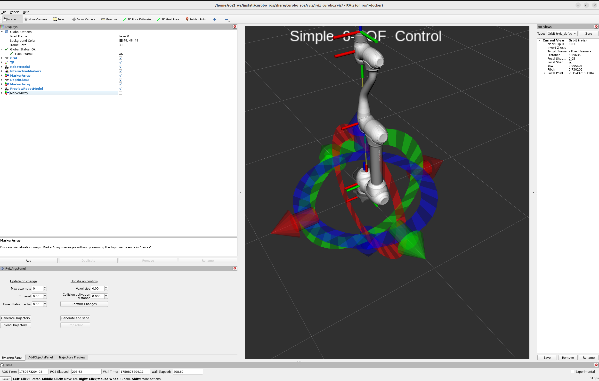

# RViz Plugin

The graphical interface is provided by the companion package [`curobo_rviz`](https://github.com/Lab-CORO/curobo_rviz) (pulled in by `my.repos`). It is a set of RViz 2 panels and displays that talk to the `unified_planner` node — everything the panels do goes through the same public services and action documented in [ROS Interfaces](ros-interfaces.md), so the GUI and the CLI are always interchangeable.

**Status**: a functional debugging and development tool; some conveniences (object preview, persistence) are still on the package's roadmap.

## Launching

The default launch starts RViz with the plugin configuration:

```bash
ros2 launch curobo_ros gen_traj.launch.py          # gui:=true is the default
```

Expect RViz to appear before the planner finishes its warmup (roughly 25–35 s): the panels stay inert until the `node_is_available` parameter flips to `true` — the panel polls it for you.



## Components

The plugin registers four components (`rviz2_plugin.xml`):

| Component | Kind | Role |
|---|---|---|
| `RvizArgsPanel` ("Curobo Rviz Panel") | Panel | Target pose, planner/strategy selection, parameters, plan/execute buttons |
| `AddObjectsPanel` | Panel | Add and remove collision obstacles |
| `AddObjectsDisplay` | Display | Renders the obstacles added from the panel |
| `ArrowInteractionDisplay` | Display | Interactive 6-DOF arrow marker for the target pose |

### Target pose — the interactive arrow

`ArrowInteractionDisplay` shows a draggable 6-DOF arrow in the 3D view. The `RvizArgsPanel` pose spin boxes (X/Y/Z, Roll/Pitch/Yaw) stay synchronized with the arrow in both directions: drag the arrow or type coordinates, whichever is easier. The pose is expressed in the robot base frame (`base_0` for the Doosan M1013).

### Main panel (`RvizArgsPanel`)



- **Target position** — the six pose spin boxes, synced with the arrow.
- **Robot** — a combo box for the control strategy (`joint_speed`, `emulator`, `joint_pose`), wired to `set_robot_strategy`.
- **Trajectory type** — a combo box for the planner, wired to `set_planner`. The combo index maps directly to the `SetPlanner` enum: 0 Classic, 1 MPC, 2 Batch, 3 Constrained. Batch and Constrained are **not implemented** in the node — selecting them makes the switch fail (and the multi-point/joint-space/retarget planners are only reachable from the CLI).
- **Obstacle Update** — "Update Obstacles" calls `get_voxel_grid` and publishes the result as a marker on `/visualise_voxel_grid`; the "Auto-update (Hz)" spin box repeats it periodically.
- **Speed (Time dilatation)** — sets the `time_dilation_factor` parameter (feedback cadence — not a robot speed control in v2).
- **Voxel size** — sets the `voxel_size` parameter and then calls `update_motion_gen_config` for you (expect the ~20 s blocking rebuild).
- **Generate Trajectory** — calls `generate_trajectory` with the arrow pose; the result is previewed by the ghost robot.
- **Send Trajectory** — sends the `execute_trajectory` action goal (reusing the cached plan when possible).
- **Generate and send** — both in one click.
- **Stop robot** — cancels the active action goal.

### MPC live tracking

When the planner combo is on **MPC** and a goal is sent, the panel starts publishing the arrow pose to `/unified_planner/mpc_goal` at 10 Hz. Dragging the arrow then retargets the robot **live** while it moves — this is the quickest way to feel what closed-loop control does. Stopping the robot (or switching planner) stops the stream. See [MPC Implementation](mpc-implementation.md).

### Objects panel (`AddObjectsPanel`)



Adds obstacles through `add_object` and removes them through `remove_object`. The type combo (Cube, Sphere, Capsule, Cylinder, Mesh) maps to the service constants — `CUBOID=0`, `SPHERE=1`, `CAPSULE=2`, `CYLINDER=3`, `MESH=4` — and the dimension fields follow the same semantics as the service (see [ROS Interfaces](ros-interfaces.md)): full extents for a cuboid, radius for a sphere, radius + length for capsule/cylinder, scale for a mesh. Added objects appear in a list; select one to remove it.

Known limitations (from the plugin's own roadmap): no preview before adding, no edit-after-add, objects added before RViz opened are not displayed, colors are unreliable.

### Trajectory preview

Planned trajectories are replayed by a translucent "preview" robot (namespace `preview/`), fed by the `/trajectory` topic through the ghost strategy. This happens for every plan, regardless of whether you execute it.



## Typical workflow

1. Launch, wait for warmup to finish.
2. Drag the arrow to a reachable pose.
3. **Generate Trajectory** — check the preview robot's path.
4. Adjust obstacles or the pose as needed; regenerate.
5. **Send Trajectory** to execute (on the emulator first — see [Tutorial 4](../tutorials/04-robot-execution.md)).



## Troubleshooting

- **Panels stay grey / buttons do nothing** — the planner is still warming up, or the node crashed; check `ros2 param get /unified_planner node_is_available` and the launch terminal.
- **No arrow in the 3D view** — add the `ArrowInteractionDisplay` display (Displays → Add → By display type); the panel logs a warning until it finds one.
- **"Trajectory type" switch fails** — you selected Batch or Constrained; both are unimplemented in the node.
- **Voxel size change froze the GUI** — that is the blocking ~20 s solver rebuild; wait for it to finish.

## Related pages

- [ROS Interfaces](ros-interfaces.md) — the services behind every button
- [Tutorial 1: First Trajectory](../tutorials/01-first-trajectory.md) — the same workflow from the CLI
- [MPC Implementation](mpc-implementation.md) — what live tracking does underneath
