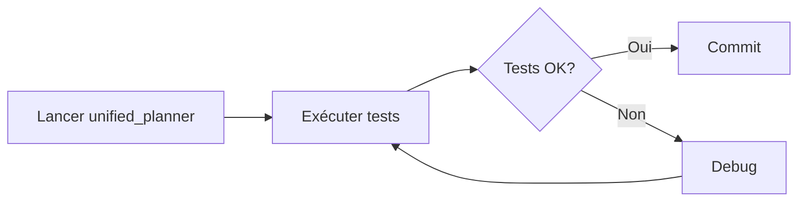

# Tests d'Intégration curobo_ros - Branche MPC

Tests d'intégration pour la branche **mpc** de curobo_ros, qui implémente le nœud **unified_planner** avec support de multiples stratégies de planification.

## 🎯 Nœud Principal: unified_planner

Le nœud `curobo_trajectory_planner` (unified_planner_node.py) est le cœur de la branche MPC.

### Commande de lancement
```bash
ros2 run curobo_ros curobo_trajectory_planner
```

### Services disponibles
- `/unified_planner/generate_trajectory` - Génération trajectoire
- `/unified_planner/set_planner` - Changement de planner
- `/unified_planner/list_planners` - Liste des planners

### Action
- `/unified_planner/execute_trajectory` - Exécution trajectoire

### Planners supportés
1. **CLASSIC** (enum=0) - Motion generation classique
2. **MPC** (enum=1) - Model Predictive Control
3. **BATCH** (enum=2) - Batch planning (future)
4. **CONSTRAINED** (enum=3) - Constrained planning (future)

## 📋 Tests Implémentés

### test_unified_planner_mpc.py
Tests du nœud unified_planner:
- ✅ Services disponibles
- ✅ Action server disponible
- ✅ Liste des planners
- ✅ Changement vers Classic
- ✅ Changement vers MPC
- ✅ Changement Classic → MPC
- ✅ Génération trajectoire avec Classic
- ✅ Génération trajectoire avec MPC

**Commande**: `pytest tests/integration/test_unified_planner_mpc.py -v`

## 🚀 Utilisation

### Prérequis
Lancer le nœud unified_planner:
```bash
ros2 run curobo_ros curobo_trajectory_planner
```

### Exécuter les tests
```bash
cd /home/user/curobo_ros
pytest tests/integration/ -v
```

### Test spécifique
```bash
pytest tests/integration/test_unified_planner_mpc.py::TestUnifiedPlannerMPC::test_set_planner_mpc -v
```

## 📊 Architecture de la Branche MPC

```
curobo_ros/core/
├── unified_planner_node.py    # Nœud principal (PRIORITÉ)
├── mpc.py                      # Nœud MPC standalone (legacy)
├── generate_trajectory.py      # Nœud classique (legacy)
├── ik.py                       # Inverse Kinematics
├── fk.py                       # Forward Kinematics
└── robot_segmentation.py       # Segmentation robot

curobo_ros/planners/
├── trajectory_planner.py       # Base class
├── single_planner.py           # Single pose planner base
├── classic_planner.py          # Classic motion generation
├── mpc_planner.py              # MPC closed-loop
├── multi_point_planner.py      # Multi-point trajectories
└── planner_factory.py          # Factory + Manager
```

## 🔄 Workflow de Test



## 🛠️ Commandes Utiles

### Vérifier les services
```bash
ros2 service list | grep unified_planner
```

### Appeler set_planner manuellement
```bash
# Classic (0)
ros2 service call /unified_planner/set_planner curobo_msgs/srv/SetPlanner "{planner_type: 0}"

# MPC (1)
ros2 service call /unified_planner/set_planner curobo_msgs/srv/SetPlanner "{planner_type: 1}"
```

### Lister les planners
```bash
ros2 service call /unified_planner/list_planners std_srvs/srv/Trigger
```

## 📝 Fixtures Disponibles

### test_poses.py
```python
from fixtures.test_poses import TestPoses, TestJointStates

# Poses
pose = TestPoses.home_pose()
pose1 = TestPoses.reach_pose_1()

# Joint states
js = TestJointStates.home_state()
```

### test_robot_configs.py
```python
from fixtures.test_robot_configs import TestRobotConfig

timeout = TestRobotConfig.SERVICE_TIMEOUT  # 10s
```

## 🐛 Dépannage

### Le nœud ne démarre pas
```bash
# Vérifier les nœuds actifs
ros2 node list

# Logs
ros2 run curobo_ros curobo_trajectory_planner --ros-args --log-level debug
```

### Tests timeout
Augmenter le timeout dans `test_robot_configs.py`:
```python
SERVICE_TIMEOUT = 20.0  # au lieu de 10.0
```

### MPC warmup lent
Le MPC peut prendre 10-20 secondes à s'initialiser la première fois. C'est normal.

## 📚 Différences avec Main

La branche **mpc** introduit:
- ✅ **unified_planner** - Nœud unifié multi-stratégies
- ✅ **Strategy Pattern** - Changement dynamique Classic/MPC
- ✅ **Lazy Loading** - Warmup à la demande
- ✅ **MPC Planner** - Closed-loop control
- ✅ **Shared Warmup** - Optimisation mémoire

Nœuds **legacy** (toujours présents mais deprecated):
- `curobo_gen_traj` - Remplacé par unified_planner
- `curobo_mpc` - Remplacé par unified_planner avec MPC strategy

## ✅ Statut des Tests

| Test | Statut | Description |
|------|--------|-------------|
| Services disponibles | ✅ | Tous les services répondent |
| Action server | ✅ | execute_trajectory disponible |
| Liste planners | ✅ | Retourne Classic, MPC, etc. |
| Set Classic | ✅ | Changement vers Classic OK |
| Set MPC | ✅ | Changement vers MPC OK |
| Switch Classic→MPC | ✅ | Changement dynamique OK |
| Gen traj Classic | ✅ | Planning avec Classic |
| Gen traj MPC | ✅ | Planning avec MPC |

## 🎓 Ressources

- [unified_planner_node.py](../../curobo_ros/core/unified_planner_node.py)
- [mpc_planner.py](../../curobo_ros/planners/mpc_planner.py)
- [Documentation ROS2 Testing](https://docs.ros.org/en/humble/Tutorials/Intermediate/Testing/Testing-Main.html)

---

**Branche**: `mpc`
**Commit de base**: `183b472 add a param to load wolrd collision setup`
**Dernière mise à jour**: 2025-12-02
